 
<details>
<summary>sys.path </summary>
The sys.path variable contains a list of directories where the Python interpreter searches for modules.
To import modules from another directory, you must add it to sys.path

import sys
sys.path.append("/path/to/dir")
</details>

<details>
<summary>Delta Lake File Statistics indicate per file: </summary>
Total number of records
Minimum value in each column of the first 32 columns of the table
Maximum value in each column of the first 32 columns of the table
Null value counts for in each column of the first 32 columns of the table

These statistics are leveraged for data skipping based on query filters. For example, if you are querying the total number of records in a table, Delta will not calculate the count by scanning all data files. Instead, it will leverage these statistics to generate the query result
</details>

<details>
<summary>Delta Sharing</summary>
is designed to securely share data across platforms using an open protocol. Since the vendor does not use Databricks, Delta Sharing ensures secure, real-time access without manual exports or third-party workarounds.

</details>

<details>
<summary>End-to-end testing </summary>
 is an approach to ensure that your application can run properly under real-world scenarios. The goal of this testing is to simulate a real user experience from start to finish.
</details>

<details>
<summary>The applyInPandas function</summary>
Used after a groupBy operation, is designed exactly for this scenario: applying a Python function that takes and returns a Pandas DataFrame to each group of data within a Spark DataFrame, while preserving state variables that are local to each group's processing logic.
</details>

<details>
<summary>The correct Databricks CLI commands to securely store a secret in Databricks Secrets are: </summary>
1- Create a new secret scope:
databricks secrets create-scope SCOPE
2- Add a secret to that scope
databricks secrets put-secret SCOPE KEY

This approach ensures that sensitive credentials are managed securely without hardcoding them in notebooks.

</details>

<details>
<summary>The string "REDACTED" will be printed.</summary>
```python
db_password = dbutils.secrets.get(scope="dev", key="database_password")
print (db_password)
```
Databricks Secrets allows you to securely store your credentials and reference them in notebooks and jobs. To prevent accidentally printing a secret to standard output buffers or displaying the value during variable assignment, Databricks redacts secret values that are read using dbutils.secrets.get(). When displayed in notebook cell output, the secret values are replaced with [REDACTED] string.
</details>

<details>
<summary>The following job definition includes tasks and job clusters, but the engineer also needs to define which user groups can manage or view the job </summary>
```yml
resources:
    jobs:
        my-job:
            name: analytics-job
            tasks: [...]
            job_clusters: [...]
            __________:
                - group_name: devops-team
                level: CAN_MANAGE
                - group_name: qa-team
                level: CAN_VIEW
```
**Ans : permissions**
The permissions mapping is used to specify the access control lists (ACLs) for the job, defining which users or groups have what level of access (like CAN_MANAGE or CAN_VIEW).
</details>

<details>
<summary>Number of tasks are operating over partitions with larger skewed amounts of data.
 </summary>
Usually, if your computation was completely symmetric across tasks, you would see all of the statistics clustered tightly around the 50th percentile value.
Here, the “Max” metrics task took 10x the time and read about 5x the data of the 75th-percentile task. This suggests a number of “straggler” tasks that operating over partitions with larger skewed amounts of data.
</details>

<details>
<summary>CREATE OR REPLACE TABLE orders_archive ; DEEP CLONE orders </summary>
Cloning can occur incrementally. Executing the CREATE OR REPLACE TABLE command can sync changes from the source to the target location.

Now, If you run DESCRIBE HISTORY orders_archive, you will see a new version of CLONE operation occurred on the table.

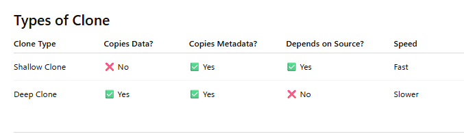

## Biggest Risk
use VACUUM : source files may get deleted. Then shallow clone can fail with:

**FileNotFoundException** : because it still references source files.
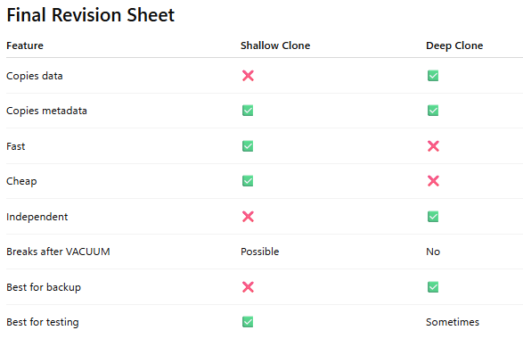
</details>

<details>
<summary>What is the key advantage of using the transform function in this scenario?</summary>
orders.transform(normalize_email).transform(calculate_total)

It allows for modular, composable, and testable transformations.

Overall explanation
The key advantage of using the transform function in this scenario is that it allows for modular, composable, and testable transformations, because transform lets you apply reusable functions to a DataFrame in a clean, chainable way, making each transformation self-contained and easier to maintain, test, and combine, without affecting execution parallelism.
</details>

<details>
<summary>pyspark.sql.DataFrame.dropDuplicates</summary>
Which of the following functions can a data engineer use to return a new DataFrame containing the distinct rows from a given DataFrame based on multiple columns?

pyspark.sql.DataFrame.dropDuplicates function returns a new DataFrame with duplicate rows removed, optionally only considering certain columns.
</details>


<details>
<summary>Streaming table</summary>
For this use case, the most suitable object is a Streaming table. Streaming tables are designed to handle near real-time data ingestion and incremental processing, allowing Lakeflow Declarative Pipelines* to continuously capture and process new records as they arrive via Auto Loader, ensuring high performance and reliability. So, streaming tables specifically support continuous, real-time updates, making them ideal for pipelines that require up-to-the-moment data freshness.

While Materialized Views (formerly known as Live Tables) provide batch-oriented or scheduled incremental processing. Temporary views, in contrast, are ephemeral and not suited for persistent, incremental streaming workloads.

* Databricks has recenlty open-sourced this solution, integrating it into the Apache Spark ecosystem under the name Spark Declarative Pipelines (SDP).
</details>

<details>
<summary>stream-stream join</summary>
When performing stream-stream join, Spark buffers past inputs as a streaming state for both input streams, so that it can match every future input with past inputs. This state can be limited by using watermarks.
</details>
<details>
<summary>Use Spark Structured Streaming to process the new records from orders_raw in batch mode using the trigger availableNow option</summary>
trigger(availableNow=True) is more compute-efficient for one-time or scheduled batch runs, as it processes all available data once and stops, avoiding the overhead of keeping a cluster running. While, the processingTime option keeps the stream active continuously, so it’s less efficient for nightly jobs.


There is also the trigger(once=True) option for incremental batch processing. However, this setting is now deprecated in the newer Databricks Runtime versions.

NOTE: You may still see this option in the current certification exam version. However, Databricks recommends you use trigger(availableNow=True) for all future incremental batch processing workloads.
</details>
<details>
<summary>Types of tasks</summary>

Configuration options and instructions vary by task. The following task types are available:

Notebook
Python script
Python wheel
SQL
Pipeline
SQL Alert (Public Preview)
Dashboards
Power BI
dbt
dbt platform (Beta)
JAR
Spark Submit
Run Job
If/else
For each

https://docs.databricks.com/aws/en/jobs/configure-task

</details>

<details>
<summary>DESCRIBE EXTENDED sales</summary>
DESCRIBE TABLE EXTENDED or simply DESCRIBE EXTENDED allows to show the added tables constraints in the ‘Table Properties’ field. It shows both the name and the actual condition of the check constraints.

In addition, DESCRIBE EXTENDED allows to show the comments on each column, and the comment on the table itself.
</details>

<details>
<summary>MERGE INTO command</summary>
MERGE INTO command allows you to upsert data from a source table, view, or DataFrame into a target Delta table. Delta Lake supports inserts, updates, and deletes in merge operations.


Note: The option to use SEQUENCE BY with MERGE INTO is incorrect because this clause only applies to AUTO CDC and APPLY CHANGES INTO, not to MERGE statements. Attempting to use SEQUENCE BY with MERGE INTO will result in a syntax error.
</details>

<details>
<summary>sha2(expression, bitLength) </summary>
In Apache Spark, the sha2(expression, bitLength) returns a checksum of the SHA-2 family as a hex string of an expression. It only supports specific SHA-2 bit lengths: 224, 256, 384, and 512. Any other bit length, such as 128, is invalid and would cause the function to fail. Notice that bitLength 0 is equivalent to 256.

So, sha2(credit_card, 128) would fail due to an unsupported bit length.
</details>

<details>
<summary>The identified records will be deleted from the customers table, but they will still be accessible in the table history until a VACUUM command is run.</summary>
Delete requests, also known as requests to be forgotten, require deleting user data that represent Personally Identifiable Information or PII, such as the name and the email of the user.

Because of how Delta Lake tables time travel are implemented, deleted values are still present in older versions of the data. Remember, deleting data does not delete the data files from the table directory. Instead, it creates a copy of the affected files without these deleted records. So, to fully commit these deletes, you need to run VACUUM commands on the customers table.
</details>

<details>
<summary>Column masks in Unity Catalog </summary>
Column masks in Unity Catalog are security features that dynamically control the visibility of sensitive data in specific columns based on the identity or role of the user executing a query. Implemented as SQL user-defined functions (UDFs), column masks replace or transform the original column values at query runtime, ensuring that unauthorized users see redacted or anonymized data.


For example, a masking function might display full Social Security Numbers (SSNs) only to users in the Human Resources department, while showing masked values like ***-**-**** to others. These masks are applied declaratively using the MASK clause:


CREATE FUNCTION mask_ssn(ssn STRING)
RETURN CASE WHEN is_member('hr_team')
THEN ssn ELSE '***-**-****' END;
 
CREATE TABLE persons(name STRING, ssn STRING MASK mask_ssn);


Why other options are incorrect:


Use a dynamic view to mask sensitive PII columns

While dynamic views can be used for masking, column-level masking in Unity Catalog is more efficient and built-in for this purpose. Dynamic views require creating and maintaining additional views manually.


Use table object privileges to revoke access on sensitive PII columns

table object privileges control access to entire tables, not specific columns. This would prevent access entirely rather than selectively hiding PII.


Use row-level filters to restrict access to region-specific customers

Row-level filtering controls which rows a user sees, but it does not protect specific columns (like emails or phone numbers) from unauthorized users.
</details>

<details>
<summary>CDF is useful when only a small fraction of records are updated in each batch</summary>
Generally speaking, we use CDF for sending incremental data changes to downstream tables in a multi-hop architecture. So, use CDF when only small fraction of records updated in each batch. Such updates are usually received from external sources in CDC format. If most of the records in the table are updated, or if the table is overwritten in each batch, like in the question, don’t use CDF.

Here is some guidance for when to use CDF (from the below reference link)
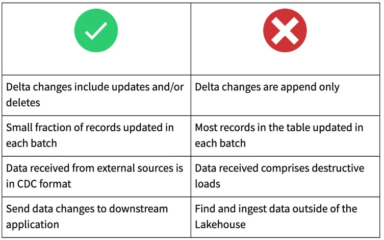
</details>

<details>
<summary>The badRecordsPath option is the standard configuration for handling bad records in Auto Loader:</summary>
df = (spark.readStream
            .format("cloudFiles")
            .option("cloudFiles.format", "json")
            .option("badRecordsPath", "s3://project/quarantine")
            .schema("id int, value double")
            .load("s3://project/source/"))

1. Handling Badly-Formed Files (e.g., Syntax Errors)

The badRecordsPath option is a Spark standard for the JSON format (and other formats like CSV). When set, any file that cannot be parsed due to malformed syntax (e.g., non-JSON content, missing brackets, extra commas) is moved to the specified path, fulfilling the requirement for excluding badly-formed JSON.


2. Handling Schema Mismatches (e.g., Data Type Errors, Missing Fields)

When badRecordsPath is set, any record that results in an error during parsing (including schema mismatch errors like failed type casting) is automatically written to the specified quarantine location instead of being dropped or failing the stream.
</details>

<details>
<summary>APPLY CHANGES APIs</summary>
Because the inventory_updates table contains updates and deletes, it breaks the append-only requirement of standard streaming tables. This means that we cannot directly stream from the base table or just skip change commits. Instead, since Change Data Feed (CDF) is enabled, the correct approach is to use spark.readStream to consume all inventory changes - including inserts, updates, and deletes - from the CDF output and apply them downstream using AUTO CDC APIs (previously known as APPLY CHANGES APIs).


Remember, to read the change data feed from a table, you need to set the option readChangeFeed to true when configuring a stream read from the table, as shown in the following syntax example:


(spark.readStream
      .option("readChangeFeed", "true")
      .table("inventory_updates")
)


Note that using spark.read here is a completely incorrect approach as it performs batch processing, not incremental processing, which would require a full table refresh each time. In addition, MERGE INTO command is not supported in Lakeflow Declarative Pipelines, making this method unsuitable for incremental change propagation.
</details>

<details>
<summary>Merge conflicts</summary>
Merge conflicts happen when two or more Git users attempt to merge changes to the same lines of a file into a common branch and Git cannot choose the “right” changes to apply. Merge conflicts can also occur when a user attempts to pull or merge changes from another branch into a branch with uncommitted changes.
</details>

<details>
<summary>Data skipping</summary>
Data skipping information is collected automatically when you write data into a table. Databricks takes advantage of this information (minimum and maximum values, null counts, and total records per file) at query time to provide faster queries.
https://docs.databricks.com/aws/en/delta/data-skipping

-- For Delta tables
ALTER TABLE table_name SET TBLPROPERTIES('delta.dataSkippingStatsColumns' = 'col1, col2, col3')

-- For Iceberg tables
ALTER TABLE table_name SET TBLPROPERTIES('iceberg.dataSkippingStatsColumns' = 'col1, col2, col3')

</details>

<details>
<summary>What is Z-ordering?</summary>

Z-ordering is a technique to colocate related information in the same set of files. Databricks data-skipping algorithms automatically use this co-locality. This behavior reduces the amount of data that needs to be read. To Z-order data, specify the columns to order on in the ZORDER BY clause:

OPTIMIZE events
WHERE date >= current_timestamp() - INTERVAL 1 day
ZORDER BY (eventType)
</details>

<details>
<summary>disk spill </summary>
The issue described is disk spill during a Spark analytical query. Disk spill occurs when the data being processed does not fit into the memory allocated for a task, so Spark writes intermediate data to disk, which is much slower than in-memory processing.


The following option would effectively reduce disk spill:

- Reduce the size of Spark partitions

Smaller partitions can help reduce memory pressure per task because each task handles less data that can fit in memory.

- Increase memory size (core-to-memory ratio)

More memory allows Spark to keep more data in-memory and reduce spills.

- Increase the number of shuffle partitions

Increasing shuffle partitions spreads the data across more tasks, reducing memory pressure per task.


However, more CPU cores allow more tasks to run in parallel, but it does not reduce the amount of memory each task requires. If memory per task is insufficient, disk spills will still happen. So, this does NOT directly address disk spill.
</details>

<details>
<summary>Auto Compaction</summary>
In Databricks and Delta Lake, Auto Compaction automatically combines many small files into fewer larger files after write operations.

It helps improve:

- Query performance
- Read efficiency
- Metadata handling

Auto Compaction is part of the Auto Optimize feature in Databricks. it checks after an individual write, if files can further be compacted, if yes, it runs an OPTIMIZE job with 128 MB file sizes instead of the 1 GB file size used in the standard OPTIMIZE

Auto compaction does not support Z-Ordering as Z-Ordering is significantly more expensive than just compaction.
</details>

<details>
<summary>SEQUENCE BY STRUCT</summary>
In Lakeflow Declarative Pipelines*, SEQUENCE BY is used to define the processing order for CDC streams, and using STRUCT allows specifying a composite key of multiple columns. This ensures that records are ordered first by transaction_timestamp and, in case of ties, by version_number, which also allows handling late-arriving data correctly.

* Databricks has recenlty open-sourced this solution, integrating it into the Apache Spark ecosystem under the name Spark Declarative Pipelines (SDP).
</details>

<details>
<summary>SET TAG</summary>
SET TAG ON
    { CATALOG catalog_name |
      COLUMN relation_name . column_name |
      EXTERNAL METADATA external_metadata_name |
      { FUNCTION | PROCEDURE } function_name |
      { SCHEMA | DATABASE } schema_name |
      TABLE relation_name |
      VIEW  relation_name |
      VOLUME volume_name }
    tag_key [ = tag_value ]

> SET TAG ON CATALOG catalog `cost_center` = `hr`;

> UNSET TAG ON CATALOG catalog cost_center;

> SET TAG ON TABLE catalog.schema.table cost_center = hr;

> UNSET TAG ON TABLE catalog.schema.table cost_center;

> SET TAG ON COLUMN table.ssn pii;

> UNSET TAG ON COLUMN table.ssn pii;

> SET TAG ON FUNCTION catalog.schema.my_func cost_center = hr;

> UNSET TAG ON FUNCTION catalog.schema.my_func cost_center;

> SELECT catalog_name, schema_name, table_name, tag_name, tag_value
    FROM information_schema.column_tags
    WHERE tag_name = 'pii' AND schema_name = 'default';
  table_name column_name
  ---------- -----------
  table      ssn

</details>

<details>
<summary>BROADCAST(table_alias)</summary>
In Spark SQL, to explicitly hint that a smaller table should be broadcast in a join, you use the /*+ BROADCAST(table_alias) */ syntax before the SELECT keyword:

SELECT /*+ BROADCAST(c) */
    s.sale_id, s.amount, c.customer_name
FROM sales AS s
INNER JOIN customers AS c
ON s.customer_id = c.customer_id;

This tells Spark to broadcast the customers table (small table) to all worker nodes, enabling a much faster join with the huge sales table.

Remember, broadcasting the smaller table sends it to all worker nodes so each partition of the large table can join locally, avoiding expensive shuffles across the cluster. This drastically reduces network I/O and speeds up the join when one table is much smaller than the other.
</details>

<details>
<summary>Databricks REST API to retrieve all runs</summary>
Sending GET requests to the endpoint ‘/api/2.2/jobs/runs/list’ allows you to retrieve all runs of a job.
</details>

<details>
<summary>Egress fees</summary>
Egress fees are incurred when data transferred between cloud providers and regions.
When data is transferred out of your cloud infrastructure to another cloud platform or to another geographic region, your cloud provider applies "data egress fees". These fees can be significant depending on the volume of data transferred. Delta Sharing itself does not add substantial cost, but the underlying cloud provider’s data transfer pricing—especially egress charges—is the primary contributor to cost increases in such scenarios.

In this scenario, AWS applies egress fees because data is transferred out of AWS to a different cloud provider (Azure) and to another geographic region (Europe).
https://docs.databricks.com/aws/en/delta-sharing/manage-egress
</details>

<details>
<summary>.withWatermark("order_timestamp", "30 minutes")</summary>
pyspark.sql.DataFrame.withWatermark function allows you to only track state information for a window of time in which we expect records could be delayed.
https://spark.apache.org/docs/3.1.1/api/python/reference/api/pyspark.sql.DataFrame.withWatermark.html
</details>

<details>
<summary>WITH HISTORY</summary>
In Databricks Delta Sharing, adding a table with history allows external recipients to both perform time travel queries and access Change Data Feed, if it’s enabled. The WITH HISTORY option automatically exposes the complete table directory, enabling CDF consumption and historical queries.
</details>

<details>
<summary>streaming deduplication</summary>
To perform streaming deduplication, we use dropDuplicates() function to eliminate duplicate records within each new micro batch. In addition, we need to ensure that records to be inserted are not already in the target table. We can achieve this using insert-only merge.
https://spark.apache.org/docs/3.1.2/api/python/reference/api/pyspark.sql.DataFrame.dropDuplicates.html
https://docs.databricks.com/delta/merge.html#data-deduplication-when-writing-into-delta-tables
</details>

<details>
<summary>iNSERT jpg IN dE;TA LAKE</summary>
df = spark.readStream.format("cloudFiles") \
          .option("cloudFiles.format", "binaryFile") \
          .option("pathGlobfilter", "*.jpg") \
          .load(“/source/x-ray”)
          https://docs.databricks.com/aws/en/ingestion/cloud-object-storage/auto-loader/patterns
</details>

<details>
<summary>Apache Arrow</summary>
https://docs.databricks.com/aws/en/pandas/pyspark-pandas-conversion
Apache Arrow is an in-memory columnar data format used in Apache Spark to efficiently transfer data between JVM and Python processes. This is beneficial to Python developers who work with pandas and NumPy data. However, its usage requires some minor configuration or code changes to ensure compatibility and gain the most benefit.
</details>

<details>
<summary>Deletion vectors in Databricks</summary>
Deletion vectors are a storage optimization feature that accelerates modifications to tables. By default, deleting a single row requires rewriting the entire Parquet file containing that record. Deletion vectors avoid this overhead. When deletion vectors are enabled, DELETE, UPDATE, and MERGE operations mark rows as modified without rewriting the Parquet file. Reads then resolve the current table state by applying the modifications recorded in deletion vectors.

All Apache Iceberg v3 tables include deletion vectors by default. See Use Apache Iceberg v3 features. For Delta Lake tables, you must explicitly enable deletion vectors.

CREATE TABLE <table-name> [options] TBLPROPERTIES ('delta.enableDeletionVectors' = true);

ALTER TABLE <table-name> SET TBLPROPERTIES ('delta.enableDeletionVectors' = true);
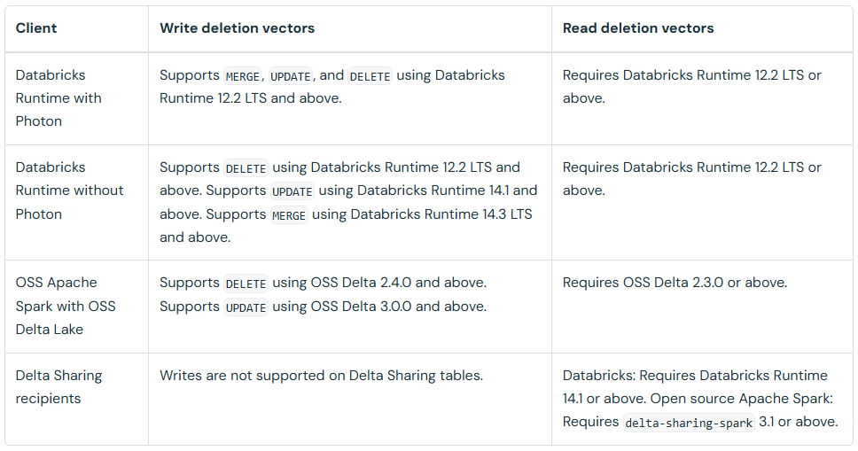
https://docs.databricks.com/aws/en/delta/deletion-vectors
</details>

<details>
<summary>Query Profile </summary>
The Query Profile view provides three panels: Details, Top operators, and Query text, which give insights into query execution metrics, the main operations involved, and the actual SQL code.

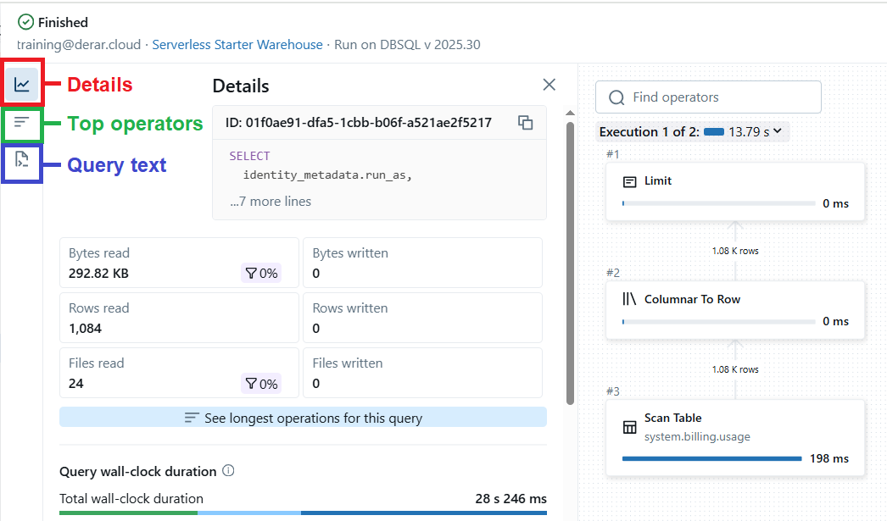
</details>
<details>
<summary>Automating jobs with schedules and triggers</summary>
In Lakeflow Jobs, it is possible to configure jobs to automatically trigger in any of the following situations:

On a time-based schedule
On the arrival of files to a Unity Catalog storage location
Continuously

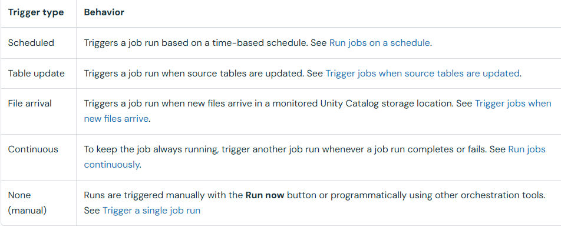

https://docs.databricks.com/aws/en/jobs/triggers
</details>
<details>
<summary> dynamic file pruning in Apache Spark? </summary>
An optimization technique that skips reading irrelevant data files during query execution based on runtime filter information. 

https://docs.databricks.com/aws/en/optimizations/dynamic-file-pruning
</details>
<details>
<summary>Cloudflare R2 </summary>

CREATE CATALOG IF NOT EXISTS my-r2-catalog
    MANAGED LOCATION 'r2://mybucket@my-account-id.r2.cloudflarestorage.com'
    COMMENT 'Location for managed tables and volumes to share using Delta Sharing';

https://docs.databricks.com/aws/en/delta-sharing/manage-egress

</details>
<details>
<summary>Delta Sharing </summary>

https://docs.databricks.com/aws/en/delta-sharing/
</details>
<details>
<summary>privileges and securable objects </summary>

https://docs.databricks.com/aws/en/data-governance/unity-catalog/access-control/privileges-reference

https://docs.databricks.com/aws/en/data-governance/table-acls/object-privileges#privileges
</details>
<details>
<summary>Dataframe Testing </summary>

https://www.databricks.com/blog/simplify-pyspark-testing-dataframe-equality-functions
</details>

<details>
<summary>rescue mode </summary>
The rescue mode ensures that the schema does not evolve, so the stream will not fail if new columns are added. Instead, any new columns are stored in the rescued data column, allowing later inspection without interrupting the stream. This meets the requirement to keep the stream running without failures and still capture new schema elements.

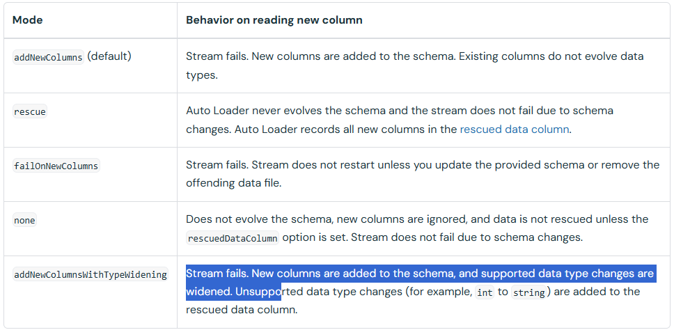

https://docs.databricks.com/aws/en/ingestion/cloud-object-storage/auto-loader/schema#how-does-auto-loader-schema-evolution-work

</details>
<details>
<summary>Table Properties </summary>

https://docs.databricks.com/aws/en/delta/table-properties#delta-table-properties


</details>

<details>
<summary>Declarative pipeline permissions from least privilege to most privilege </summary>

CAN VIEW → CAN RUN → CAN MANAGE

n permission hierarchies, least privilege to most privilege means starting with the minimal access and ending with full control.

CAN VIEW: allows only viewing pipeline details, Spark UI, and driver logs.
CAN RUN: allows executing the pipeline but not modifying it.
CAN MANAGE: allows full control, including executing, editing, deleting, and managing permissions.
The same concept applies to job permissions

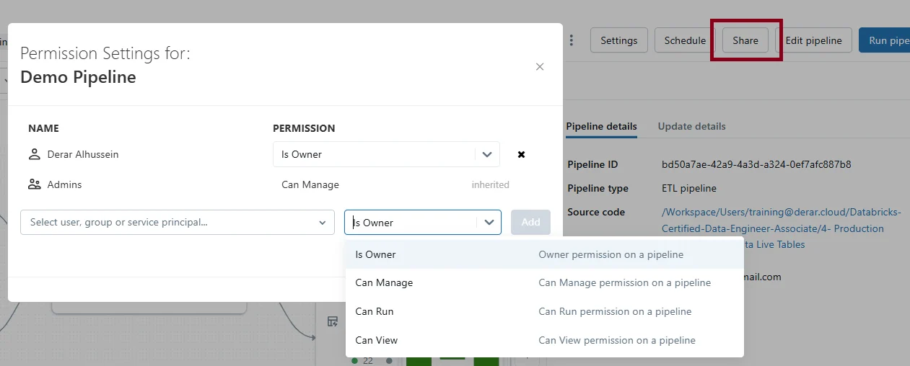

</details>

<details>
<summary>Manage data quality with pipeline expectations </summary>

https://docs.databricks.com/aws/en/ldp/expectations

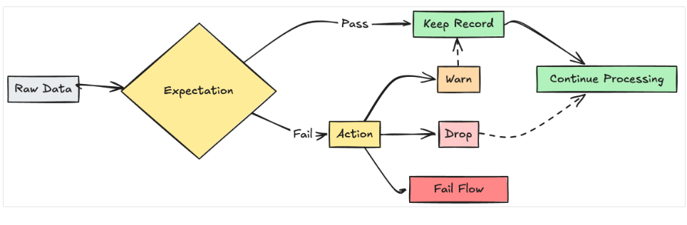

</details>

<details>
<summary>Unit Testing </summary>

https://docs.databricks.com/aws/en/notebooks/testing

</details>

<details>
<summary>Predictive optimization for Unity Catalog managed tables </summary>

https://docs.databricks.com/aws/en/optimizations/predictive-optimization

</details>

<details>
<summary>All API Detail</summary>

https://docs.databricks.com/api/workspace/jobs

</details>

<details>
<summary>cluster permissions </summary>

https://docs.databricks.com/aws/en/compute/clusters-manage#cluster-level-permissions

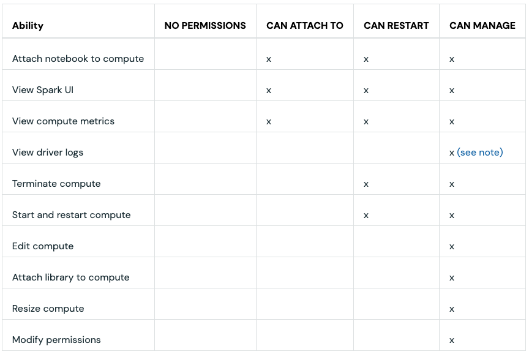
</details>

<details>
<summary>pathGlobFilter </summary>
The pathGlobFilter option allows you to filter input files based on a glob pattern, such as *.png, when using Auto Loader.

https://docs.databricks.com/aws/en/ingestion/cloud-object-storage/auto-loader/patterns

</details>

<details>
<summary>Add notifications on a job</summary>
https://docs.databricks.com/aws/en/jobs/notifications

Job-level notifications: Trigger only when the entire job succeeds or fails.

This means if an individual task fails but is retried successfully, no notification is sent until the overall job completes or fails.

Task-level notifications: Trigger for each task event, including failures, or successful completions.

</details>

<details>
<summary>OAuth token federation for a Databricks service principal </summary>

https://docs.databricks.com/aws/en/dev-tools/auth/#authorization-methods
Databricks Asset Bundles are a feature of the Databricks CLI. To enable the CLI to authenticate to Databricks without managing Databricks secrets, it’s recommended to use OAuth token federation for a Databricks service principal in the target workspace.
</details>

<details>
<summary> READ permission on the “DataOps-Prod” scope</summary>
The secret access permissions are as follows:


MANAGE - Allowed to change ACLs, and read and write to this secret scope.

WRITE - Allowed to read and write to this secret scope.

READ - Allowed to read this secret scope and list what secrets are available.


Each permission level is a subset of the previous level’s permissions (that is, a principal with WRITE permission for a given scope can perform all actions that require READ permission).


</details>

<details>
<summary>Data Sharing </summary>
1- Databricks-to-Databricks sharing (D2D): it lets you share data from your Unity Catalog-enabled workspace with clients who also have access to a Unity Catalog-enabled Databricks workspace.

This approach uses the Delta Sharing server that is built into Databricks and provides support for notebook sharing, Unity Catalog data governance, auditing, and usage tracking for both providers and recipients.

2- Databricks open sharing protocol (D2O): It lets you share data that you manage in a Unity Catalog-enabled Databricks workspace with users on any computing platform.

This approach also uses the Delta Sharing server that is built into Databricks and is useful when you manage data using Unity Catalog and want to share it with users who don't use Databricks or don't have access to a Unity Catalog-enabled Databricks workspace.

So, D2D is optimized for seamless sharing within the Databricks ecosystem, whereas D2O extends interoperability to external platforms that support the open Delta Sharing protocol.
</details>

<details>
<summary>Cluster</summary>

https://docs.databricks.com/aws/en/compute/use-compute#what-are-compute-access-modes

</details>

<details>
<summary>dlt.expect_all </summary>

dlt.expect_all enforces all the specified data quality rules, writes both valid and invalid records to the target table, and captures metrics about any rule violations.

dlt.expect would not fully meet the requirements because it applies expectations individually but doesn’t automatically enforce all of them together as a group. Similarly, dlt.expect_or_drop removes individual invalid records, and dlt.expect_or_fail stops the pipeline on individual rule violations. You can group multiple expectations together and specify collective actions using the functions dlt.expect_all_or_drop, and dlt.expect_all_or_fail.

Note: Databricks has recenlty open-sourced this solution, integrating it into the Apache Spark ecosystem under the name Spark Declarative Pipelines (SDP).

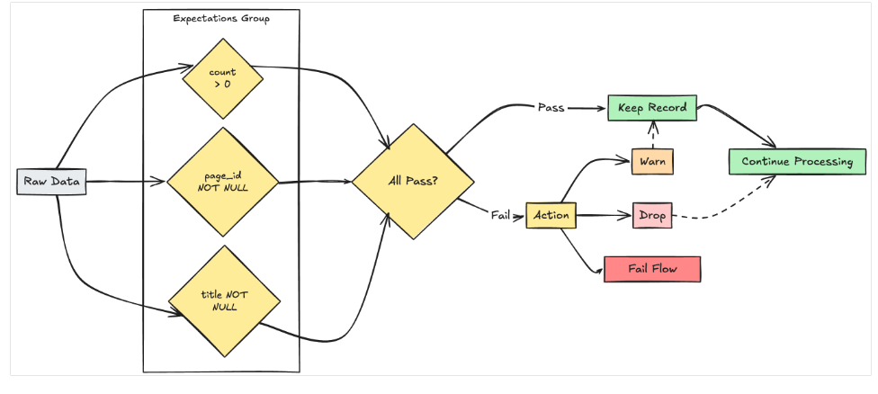

https://docs.databricks.com/aws/en/ldp/expectations#multiple-expectations-management

</details>

<details>
<summary>programmatically extract the data quality results of a LDP pipeline </summary>
In the event log table for LDP* pipelines, the data quality results are logged under events of type 'flow_progress' and stored inside the details column in a nested JSON structure:

details:flow_progress: contains information about a pipeline’s execution progress

details:flow_progress.data_quality: contains the data quality results (expectations, dropped_records, etc.)

details:flow_progress:data_quality.expectations: specifically holds the expectation results

* Databricks has recenlty open-sourced this solution, integrating it into the Apache Spark ecosystem under the name Spark Declarative Pipelines (SDP).
</details>

<details>
<summary>DataFrameWriter.mode </summary>

DataFrameWriter.mode defines the writing behaviour when data or table already exists.

Options include:

append: Append contents of the DataFrame to existing data.

overwrite: Overwrite existing data.

error or errorifexists: Throw an exception if data already exists.

ignore: Silently ignore this operation if data already exists.

This errorifexists or error is the default save mode. If the table already exists, it will throw the error message Error: pyspark.sql.utils.AnalysisException: table already exists.

The "employees_performance" table has a date column. So, in order to be able to compare employees' performance across time, each new batch of data with new date should be appended into the table using the append mode.

https://spark.apache.org/docs/latest/api/python/reference/pyspark.sql/api/pyspark.sql.DataFrameWriter.mode.html

</details>

<details>
<summary>Spark UI </summary>

https://spark.apache.org/docs/latest/web-ui.html

</details>

<details>
<summary> jobs command group </summary>

https://docs.databricks.com/aws/en/dev-tools/cli/reference/jobs-commands

</details>

<details>
<summary>D2D and D2O </summary>
Databricks-to-Databricks sharing (D2D) uses built-in authentication with no token exchange, allowing internal teams to access shared data seamlessly within the Databricks environment, whereas open Delta Sharing (D2O) requires external authentication, typically via bearer tokens or OIDC federation, to securely grant external partners access to the data.
https://docs.databricks.com/aws/en/delta-sharing/create-recipient-oidc-fed
</details>

<details>
<summary>liquid clustering for tables </summary>
To cluster the newly added data in a Delta Lake table with liquid clustering enabled, the data engineer should execute the OPTIMIZE command. OPTIMIZE triggers the clustering operation by physically reorganizing the data files to improve query performance.

https://docs.databricks.com/aws/en/delta/clustering

</details>

<details>
<summary>Predictive optimization for Unity Catalog managed tables </summary>

https://docs.databricks.com/aws/en/optimizations/predictive-optimization

</details>

<details>
<summary> </summary>

</details>

<details>
<summary> </summary>

</details>
<details>
<summary> </summary>

</details>

<details>
<summary> </summary>

</details>

<details>
<summary> </summary>

</details>

<details>
<summary> </summary>

</details>

<details>
<summary> </summary>

</details>

<details>
<summary> </summary>

</details>

<details>
<summary> </summary>

</details>

<details>
<summary> </summary>

</details>

<details>
<summary> </summary>

</details>

<details>
<summary> </summary>

</details>