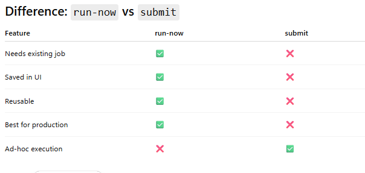

Secret scopes

In Databricks, secret scopes are used to manage and organize secrets. By setting "Read" permissions on a secret scope containing the credentials, you allow the team to access the necessary credentials without granting unnecessary privileges. This approach ensures that the teams have the minimum necessary access to the credentials required for connecting to the external database. "Manage" permissions would provide more access than needed for just using the credentials.

 MEMORY_ONLY

No memory → No cache
NOT → Spill to disk

Job Id 

The globally unique ID of the newly triggered run.

 Jobs

What is databricks jobs?

The jobs command group is used to:

Create jobs
Run jobs
Monitor runs
Cancel runs
Update jobs
Manage permissions

# Most Important Databricks Jobs Commands

| Command | Purpose | Command |
|---|---|---|
| `create` | Create new job | databricks jobs create --json @job.json |
| `run-now` | Trigger existing job | databricks jobs run-now JOB_ID : Run Existing |
| `submit` | One-time temporary run | databricks jobs submit --json @submit.json |
| `list` | List jobs | databricks jobs list Option : --limit --name --expand-tasks
| `list-runs` | List job executions | databricks jobs list-runs : --active-only --completed-only --job-id
| `get` | Get job details | databricks jobs get JOB_ID : Tasks Clusters Parameters, Schedule , Notifications |
| `get-run` | Get run details |
| `cancel-run` | Stop running job |
| `delete` | Delete job |
| `update` | Partial update |
| `reset` | Replace all settings |
| `repair-run` | Rerun failed tasks |

**Important Exam Point : submit jobs are NOT saved**

Meaning:
- No permanent job object
- No retries
- No UI visibility

Ganglia Basics

# Ganglia Basics for Databricks

## What is Ganglia?

Ganglia is a cluster monitoring tool used in Databricks to monitor the health and performance of Spark clusters.

It provides real-time metrics about:
- CPU usage
- Memory usage
- Network traffic
- Disk I/O
- JVM metrics
- Spark executor behavior

In Databricks, Ganglia helps identify:
- Bottlenecks
- Underutilized resources
- Data skew
- Shuffle-heavy workloads
- Memory pressure

---

# How to Open Ganglia in Databricks

1. Open the Databricks workspace
2. Go to **Compute / Clusters**
3. Select a running cluster
4. Open the **Metrics** tab
5. Click **Ganglia UI**

---

# Ganglia Architecture

Ganglia monitors:
- Driver node
- Executor nodes
- Cluster-level metrics

For Spark clusters:
- Driver coordinates tasks
- Executors perform computation

Ganglia visualizes metrics for each node.

---

# Important Ganglia Metrics

## 1. CPU Utilization

### Meaning
Shows how much CPU is being used.

### Healthy Range
- Usually 60%–80%

### Problems
| CPU Usage | Meaning |
|---|---|
| Very Low | Cluster underutilized |
| Near 100% | CPU bottleneck |
| Around 75% | Good utilization |

### Exam Tip
High CPU utilization generally means Spark executors are actively processing tasks.

---

# 2. Load Average

## Meaning
Represents the number of runnable or waiting processes.

### Healthy Sign
- Stable values
- No continuous increase

### Problems
- Constantly rising load average
- High load with low CPU efficiency

### Exam Tip
Flat load average alone does NOT prove healthy utilization.

---

# 3. Memory Usage

## Meaning
Shows RAM consumption on executors.

### Important Concepts
- Cached data
- Shuffle memory
- Execution memory

### Problems
| Symptom | Meaning |
|---|---|
| Frequent garbage collection | Memory pressure |
| OutOfMemory errors | Insufficient memory |
| Spill to disk | Memory shortage |

---

# 4. Network I/O

## Meaning
Shows data transferred between nodes.

### Common Causes
- Shuffle operations
- Joins
- Aggregations

### Important
Network spikes are NORMAL in Spark.

### Exam Tip
Heavy shuffle workloads create high network traffic.

---

# 5. Disk I/O

## Meaning
Shows disk read/write operations.

### Common Causes
- Spill-to-disk
- Shuffle writes
- Caching

### Problems
High disk activity may indicate:
- Insufficient memory
- Large shuffle operations

---

# Spark Operations That Affect Ganglia Metrics

| Spark Operation | Ganglia Impact |
|---|---|
| Wide transformations | High network I/O |
| Large joins | Shuffle spikes |
| Caching | Higher memory usage |
| Skewed data | Uneven executor utilization |
| Spill to disk | High disk I/O |

---

# Common Bottleneck Patterns

## CPU Bottleneck
### Symptoms
- CPU near 100%
- Long task duration

### Solution
- Add executors
- Optimize code
- Partition data better

---

# Memory Bottleneck

## Symptoms
- Spill to disk
- GC overhead
- OutOfMemory errors

### Solution
- Increase executor memory
- Reduce caching
- Optimize joins

---

# Shuffle Bottleneck

## Symptoms
- High network I/O
- Long shuffle stages

### Solution
- Reduce shuffle operations
- Broadcast small tables
- Optimize partitioning

---

# Data Skew Indicators

## Symptoms
- One executor overloaded
- Uneven task duration
- Some executors idle

### Common Causes
- Uneven key distribution

### Solutions
- Salting keys
- AQE (Adaptive Query Execution)
- Skew hints

---

# Ganglia and Databricks Exam Tips

## Very Important Concepts

### Healthy Cluster
- CPU around 75%
- Stable memory usage
- Moderate network spikes
- Limited disk spill

### Bad Signs
- Excessive GC
- Constant spill-to-disk
- One executor overloaded
- Very low CPU utilization

---

# Frequently Tested Exam Concepts

| Topic | Importance |
|---|---|
| CPU utilization | High |
| Shuffle/network spikes | High |
| Spill-to-disk | High |
| Data skew | High |
| AQE | High |
| Executor bottlenecks | High |

---

# Quick Memory Notes

| Metric | Healthy Sign |
|---|---|
| CPU | ~75% utilized |
| Memory | No excessive spill |
| Network | Some spikes are OK |
| Disk | Minimal spill |
| Load Average | Stable |

---

# Final Exam Shortcut

## Think Like This

| Observation | Likely Cause |
|---|---|
| High CPU | Compute-heavy workload |
| High network | Shuffle-heavy workload |
| High disk I/O | Memory spill |
| Uneven executors | Data skew |
| Low CPU | Underutilized cluster |

---

 

 

 

 

 

 

 

 

 

 

 

 

 

 

 

 

 

 

 

 

 

 

 

 

 

 

 

 

 

 

 

 

 

 

 

 

 

 

 

 

 

 

 

 

 

 

 

 

 

 

 

 

 

 

 

 

 

 

 

 

 

 

 

 

 

 

 

 

 

 

 

 

 

 

 

 

 

 

 

 

 

 

 

 

 

 

 

 

 

 

 

 

 

 

 

 

 

 

 

 

 

 

 

 

 

 

 

 

 

 

 

 

 

 

 

 

 

 

 

 

 

 

 

 

 

 

 

 

 

 

 

 

 

 

 

 

 

 

 

 

 

 

 

 

 

 

 

 

 

 

 

 

 

 

 

 

 

 

 

 

 

 

 

