# Regulatory Compliance — GDPR & CCPA  
(Concise Databricks Professional Exam Summary)

## 1. Key Regulations
- **[GDPR](ca://s?q=Explain_GDPR_in_data_platforms)** — General Data Protection Regulation (EU)  
- **[CCPA](ca://s?q=Explain_CCPA_in_data_platforms)** — California Consumer Privacy Act (US)

Both frameworks define strict rules for how organizations collect, store, process, and delete personal data.

---

## 2. Core Compliance Requirements
- **Inform customers** about what personal information is collected and how it is used.  
- **Delete, update, or export personal data** upon verified user request.  
- **Respond within required timelines** (typically **30 days**).  
- Maintain transparency, auditability, and secure handling of personal data.

---

## 3. Why This Matters in Data Platforms
- Streaming and batch systems must support **data subject rights** (DSRs).  
- Lakehouse architectures must enable:  
  - **[Data deletion](ca://s?q=How_to_handle_data_deletion_requests_in_Delta_Lake)** (right to be forgotten)  
  - **[Data correction](ca://s?q=How_to_update_personal_data_in_Delta_Lake)**  
  - **[Data export](ca://s?q=How_to_export_user_data_for_GDPR)**  
- Compliance requires durable storage, lineage, and the ability to trace and remove personal data across Bronze/Silver/Gold layers.

---

## Exam‑Ready Takeaway
GDPR and CCPA require organizations to **inform users**, **honor data modification/deletion requests**, and **respond within 30 days**.  
Modern data platforms must support these rights through strong governance, lineage, and reliable data‑management patterns.

# How Databricks Simplifies Regulatory Compliance  
(Concise Databricks Professional Exam Summary)

## 1. Reduce Copies of PII
Minimizes the number of locations where **personally identifiable information** is stored, lowering risk and simplifying compliance workflows.

## 2. Find Personal Information Quickly
Leverages centralized governance (Unity Catalog), metadata, and search capabilities to **locate PII efficiently** across tables and layers.

## 3. Reliably Change, Delete, or Export Data
Delta Lake’s ACID transactions and time‑travel capabilities make it possible to **update, delete, or export user data** accurately and consistently to satisfy GDPR/CCPA requests.

## 4. Built‑In Optimizations for Compliance
- **Z‑Ordering** improves data skipping, making PII lookups faster.  
- **VACUUM** cleans up obsolete or deleted data, supporting right‑to‑erasure requirements.

## 5. Transaction Logs for Auditing
Delta Lake’s transaction log provides a **complete audit trail** of all operations, enabling traceability, accountability, and compliance reporting.

## Exam‑Ready Takeaway
Databricks simplifies GDPR/CCPA compliance by reducing PII duplication, enabling fast discovery, supporting reliable data modification/deletion, optimizing storage for efficient access, and providing built‑in auditability through Delta transaction logs.

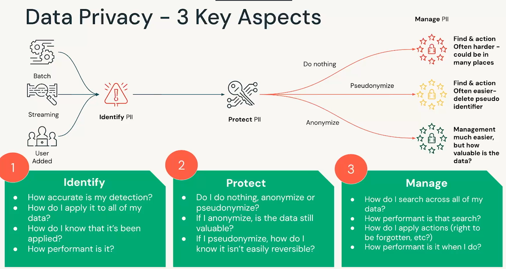

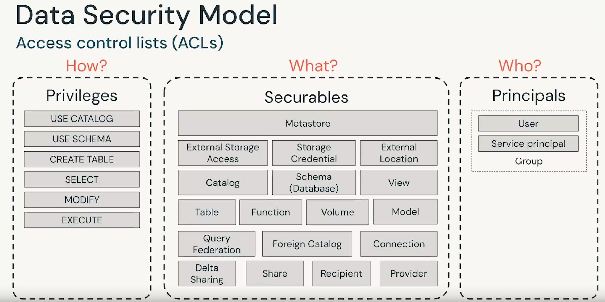

# Data Security Model — Managing ACLs  
(Concise Databricks Professional Exam Summary)

## 1. SQL-Based Access Control
Use SQL GRANT/REVOKE statements to manage permissions directly on catalogs, schemas, tables, and views.

Examples:  
```sql
GRANT SELECT ON TABLE t TO analysts;
REVOKE SELECT ON TABLE t FROM analysts;
```

### Ideal for automated pipelines, CI/CD, and reproducible security configurations.

## 2. Catalog Explorer (UI)
Manage ACLs visually through the Data Science & Engineering workspace or Databricks SQL interface.
- Browse catalogs, schemas, and tables
- Assign permissions to users, groups, and service principals
- Useful for quick inspection, troubleshooting, and administrative workflows

3. Programmatic ACL Management
- Automate and version‑control security configurations using:
- Databricks CLI
- Terraform (IaC)

**REST APIs**

- Enables repeatable, scalable, and environment‑consistent permission management.

**Exam‑Ready Takeaway**

- Databricks ACLs can be managed through SQL, UI, or programmatic tools.
- SQL provides precision, the UI offers convenience, and programmatic methods ensure - automation and consistency across environments.
# Tagging & AI‑Generated Documentation in Unity Catalog  
(Concise Databricks Professional Exam Summary)

## 1. Auto‑Generated Documentation
Unity Catalog can **auto‑generate concise, informative table and column comments** using AI.  
This helps teams quickly understand schema intent, business meaning, and data usage.

### Benefits
- **Document missing metadata in minutes**  
- Automatically produce **clear, standardized descriptions**  
- Improve discoverability and governance across catalogs

---

## 2. Tagging for Governance & Discovery
Tagging allows you to attach metadata labels to tables, columns, and other assets.

### Uses
- **[Easier data discovery](ca://s?q=Explain_data_discovery_with_tags_in_Unity_Catalog)** across large catalogs  
- **[Tag‑based policies](ca://s?q=How_tag_based_policies_work_in_Unity_Catalog)** for PII, compliance, or sensitivity levels  
- Enable automated governance workflows (e.g., mask all `PII`‑tagged columns)

---

## Exam‑Ready Takeaway
Unity Catalog’s **AI‑generated documentation** and **tagging** capabilities streamline metadata management, accelerate documentation of large backlogs, and enable **policy‑driven governance** through consistent, searchable metadata.

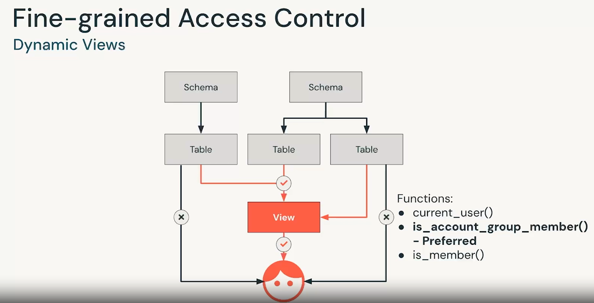

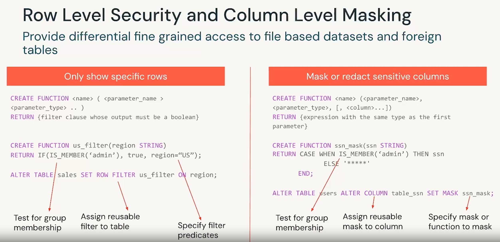

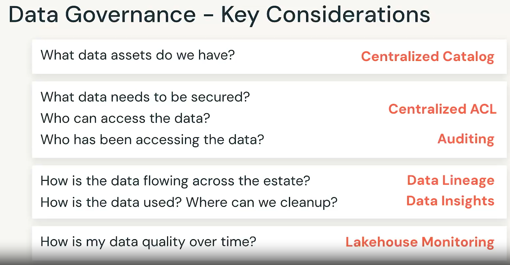

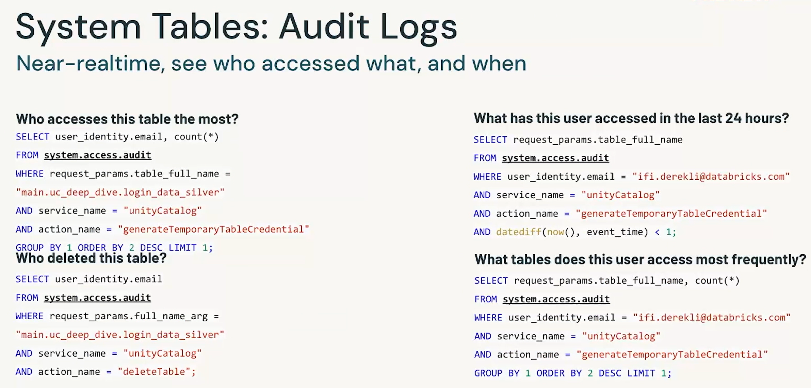

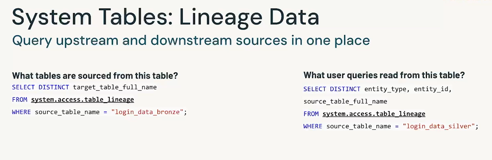

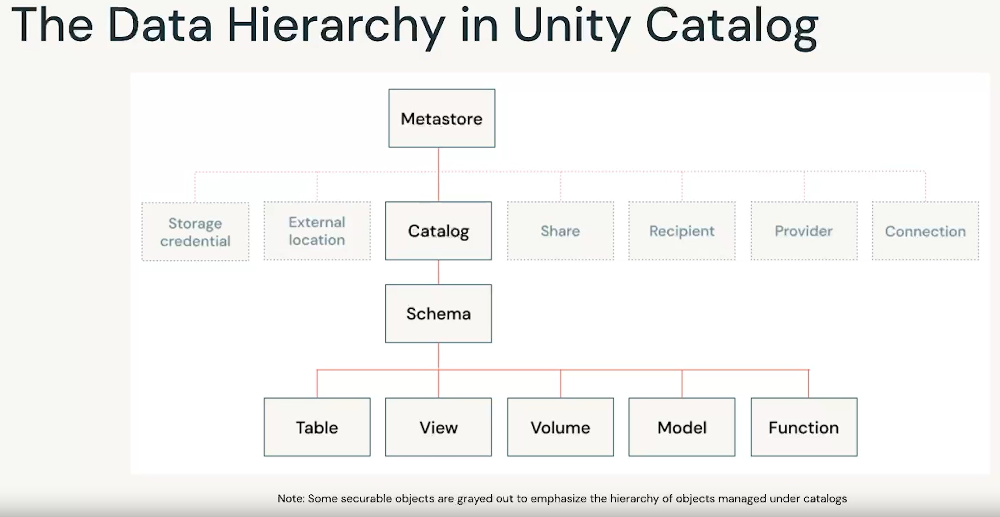

# Unity Catalog Core Objects — Metastores, Catalogs, and Volumes  
(Concise Databricks Professional Exam Summary)

## 🗂️ Metastores  
- Manage **data assets** (tables, views, volumes) and the **permissions** governing access.  
- Admins create **one metastore per region**.  
- A metastore can be **mapped to one or more workspaces** within the same region.  
- Provide **regional isolation**, but **not** intended as the primary unit of data isolation.  
- Best thought of as the **top‑level governance boundary**.

---

## 📚 Catalogs  
- The **primary unit of data isolation** in Unity Catalog.  
- Commonly aligned with **organizational units**, **domains**, or **SDLC scopes** (dev/test/prod).  
- Can be stored:  
  - **Inside the metastore**, or  
  - **Separately from the metastore** (preferred for portability and isolation).  
- Can be **bound to specific workspaces**.  
- Ideal location to define **inherited permissions** for schemas and tables.  
- Enable clean separation of data domains and governance policies.

---

## 📦 Volumes  
- Designed for **non‑tabular data**.  
- Store **structured, semi‑structured, or unstructured** files.  
- Perfect for:  
  - Libraries  
  - Configurations  
  - Checkpoint folders  
  - ML artifacts  
- Data in volumes **cannot be registered as tables**.  
- Provide a governed alternative to unmanaged cloud storage paths.

---

## Exam‑Ready Takeaway  
- **Metastores** → regional governance boundary; map to workspaces.  
- **Catalogs** → main unit of data isolation; ideal for permission inheritance.  
- **Volumes** → governed storage for non‑tabular data (configs, checkpoints, files).


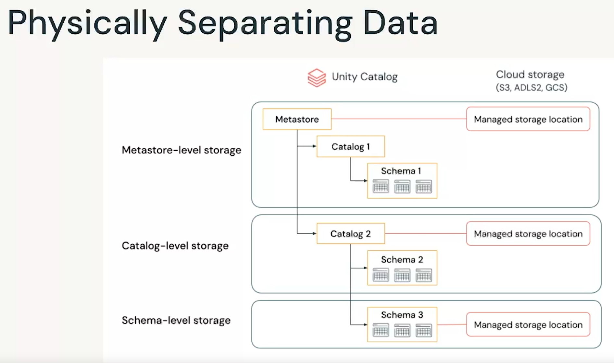
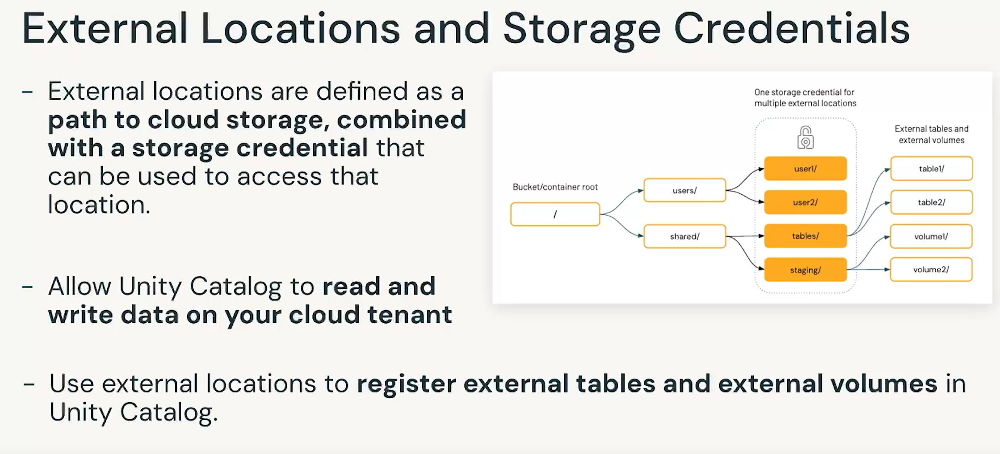
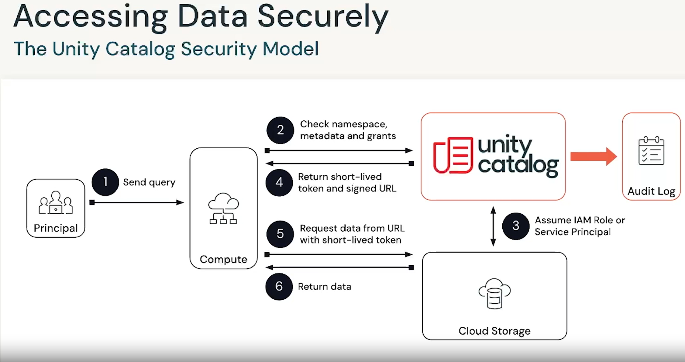
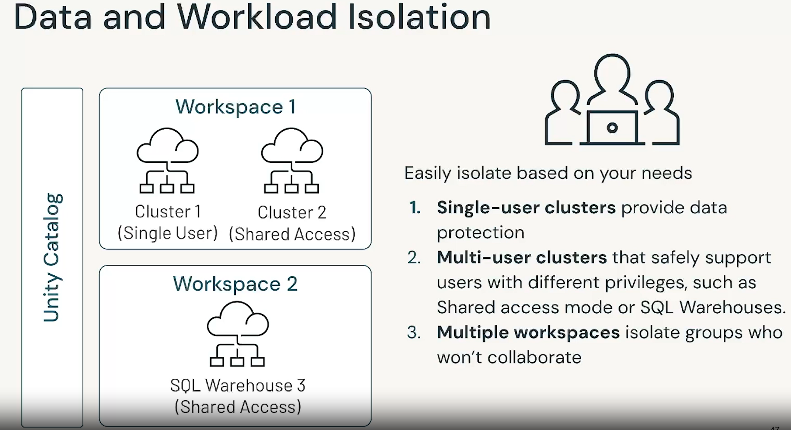
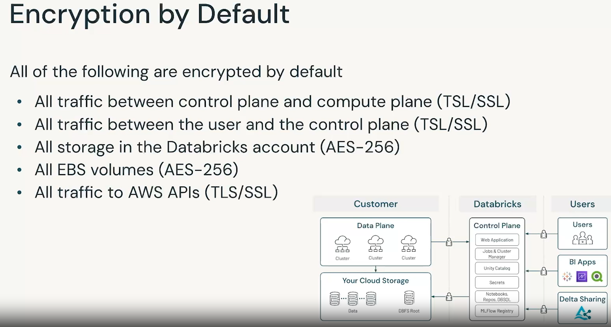


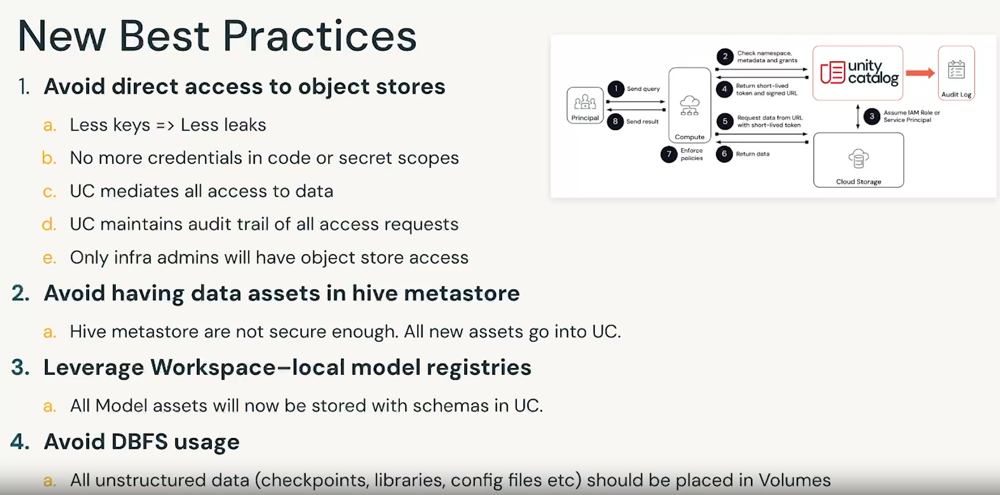
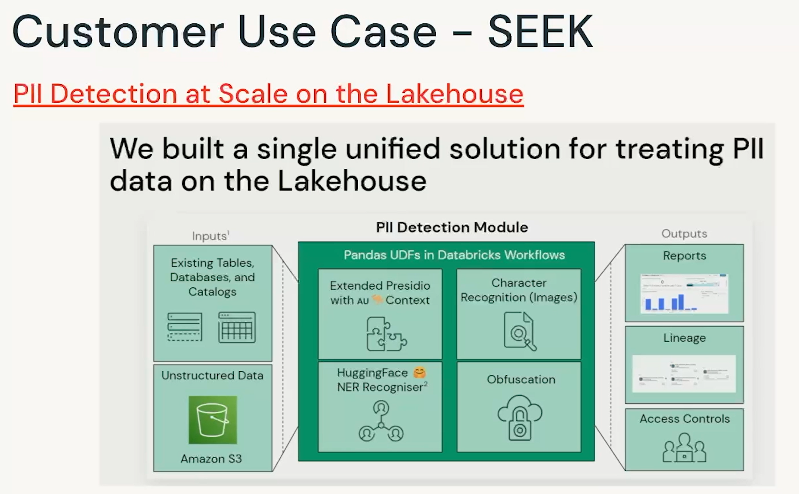


### Grant Explicit privileges on Schema or Objects
```sql
SHOW GRANTS ON SCHEMA pii_data;
```

# Unity Catalog Security Functions  
(Concise Databricks Professional Exam Summary)

## 1. `current_user()`
Returns the **email address** of the user querying the view.

Useful for:
- **[Row‑level filtering](ca://s?q=Explain_row_level_security_with_current_user)**  
- **[Personalized views](ca://s?q=How_to_use_current_user_in_views)**  
- Auditing and access‑aware logic

---

## 2. `is_account_group_member()`
Returns **TRUE** if the querying user is a member of the **specified account‑level group**.

Characteristics:
- Works across **all workspaces** in the account  
- Recommended for **production** because it avoids workspace‑local dependencies  
- Ideal for **centralized governance** and **cross‑workspace policies**

---

## 3. `is_member()`
Returns **TRUE** if the querying user is a member of a **workspace‑local group**.

⚠️ **Databricks advises against using `is_member()` in production**  
Why:
- It references **workspace‑local groups**  
- Introduces **workspace dependency** into a metastore that may span multiple workspaces  
- Breaks portability and consistency across environments

Use **`is_account_group_member()`** instead for enterprise‑grade governance.

---

## Exam‑Ready Takeaway
- **`current_user()`** → identifies the querying user  
- **`is_account_group_member()`** → recommended; checks account‑level group membership  
- **`is_member()`** → avoid in production; tied to workspace‑local groups  

These functions are essential for implementing **row‑level security**, **column‑level security**, and **dynamic access policies** in Unity Catalog.


# Applying and Verifying a ROW FILTER in Unity Catalog  
(Concise Databricks Professional Exam Summary)

## 1. Assign the `loyalty_row_filter` Policy to a Column
Use an `ALTER TABLE` statement with **WITH ROW FILTER** to attach the row‑level security function to the `loyalty_segment` column.

### Example
```sql
ALTER TABLE customers_silver_with_row_filter_and_column_masks
SET ROW FILTER loyalty_row_filter ON (loyalty_segment);

```
This binds the loyalty_row_filter function so that every query on this table automatically enforces row‑level filtering based on the user context.

### 2. Confirm the ROW FILTER Assignment
Use DESCRIBE EXTENDED to verify that the row filter is active on the table.

**DESCRIBE EXTENDED customers_silver_with_row_filter_and_column_masks;**

You will see metadata entries showing:
The ROW FILTER function applied 
The column(s) it is bound to Any column masks if also configured

**Exam‑Ready Takeaway**
Apply row filters using ALTER TABLE … SET ROW FILTER.
Verify configuration using DESCRIBE EXTENDED.
Row filters enforce dynamic, user‑aware access control directly at the table level.

# Comparing Results: Dynamic Views vs. Row Filters + Column Masks  
(Concise Databricks Professional Exam Summary)

## 1. Purpose of the Comparison
This comparison validates that **dynamic views** and **table‑level row filters + column masks** can produce **equivalent security‑filtered results** for the same underlying data.

Both approaches enforce:
- **Row‑level security**  
- **Column‑level masking**  
- **User‑aware access control**

The goal is to confirm that the **effective output** is identical.

---

## 2. Row Count Comparison Query
The following SQL checks whether both secured datasets return the **same number of visible rows** for the current user:

```sql
SELECT
  (SELECT count(*) FROM customers_silver_with_row_filter_and_column_masks) =
  (SELECT count(*) FROM customers_gold_dynamic_view) AS equal_row_count;

3. Why This Matters
Demonstrates functional equivalence between:

Dynamic views (logic embedded in the view definition)

Row filters + column masks (logic enforced at the table level)

Validates that Unity Catalog’s table‑level security policies can fully replace dynamic views.

Table‑level policies are generally:
Easier to maintain
More scalable
More consistent across workspaces
Better aligned with enterprise governance

Exam‑Ready Takeaway
Dynamic views and table‑level row filters + column masks can produce identical results.
The row‑count comparison confirms that both approaches enforce the same security behavior for the current user.


# Dynamic Views vs. Row Filters — Discussion  
(Concise Databricks Professional Exam Summary)

## 1. Shared Purpose
Dynamic views, row filters, and column masks all allow you to apply **complex, user‑aware logic** at **query runtime**.  
They support:
- **[Row‑level security](ca://s?q=Explain_row_level_security_in_Unity_Catalog)**  
- **[Column‑level masking](ca://s?q=Explain_column_masking_in_Unity_Catalog)**  
- **Context‑aware filtering based on user identity**

All three mechanisms evaluate logic dynamically, ensuring that each user sees only the data they are authorized to access.

---

## 2. When to Use Dynamic Views
Use **dynamic views** when:
- You need to apply **transformation logic** (filters, masks, computed columns).  
- The underlying tables are **read‑only** or cannot be modified.  
- It is acceptable for users to query a **different object name** (the view instead of the table).  
- You want to encapsulate logic in a **view definition** rather than modifying table metadata.

Dynamic views are flexible and powerful but introduce an extra object layer that users must reference.

---

## 3. When to Use Row Filters & Column Masks
Use **row filters** and **column masks** when:
- You want to enforce security **directly on the table**.  
- Users should continue querying the table **by its original name**.  
- You prefer **centralized, metadata‑level governance** rather than view‑based logic.  
- You want consistent enforcement across all workspaces and compute environments.

These policies are ideal for enterprise‑grade governance because they attach directly to the table and are inherited automatically.

---

## Exam‑Ready Takeaway
- **Dynamic Views** → best for applying transformation logic on read‑only tables; users query the view.  
- **Row Filters & Column Masks** → best for enforcing security while keeping the original table name; logic lives in table metadata.  
- All three evaluate logic at **query runtime**, but table‑level policies provide cleaner, more scalable governance.

# Tagging in Unity Catalog  
(Concise Databricks Professional Exam Summary)

## 1. What Tags Are
Tags are **attributes with keys and optional values** that can be attached to securable objects to **organize, classify, and govern** data assets.

They support:
- **[Data classification](ca://s?q=Explain_data_classification_with_tags_in_Unity_Catalog)**  
- **[Security policies](ca://s?q=How_to_use_tags_for_security_policies_in_Unity_Catalog)**  
- **[Lifecycle management](ca://s?q=Lifecycle_management_with_tags_in_Databricks)**  
- **[Compliance workflows](ca://s?q=Compliance_tagging_in_Unity_Catalog)**  
- **Project and domain organization**

---

## 2. Supported Objects
Tags can be applied to many Unity Catalog securables, including:

- **Catalogs**  
- **Schemas**  
- **Tables**  
- **Columns**  
- **Volumes**  
- **Views**  
- **Registered models**  
- **Model versions**

This makes tagging a **unified metadata strategy** across the entire Lakehouse.

---

## 3. Search & Discovery
Tags significantly improve **workspace search** by enabling users to quickly locate:
- PII‑tagged columns  
- Domain‑specific tables  
- Gold/Silver/Bronze assets  
- Compliance‑sensitive datasets  

This enhances productivity and governance at scale.

---

## 4. Tag Limits & Structure
- Up to **20 tags per object**  
- **Key length:** up to 255 characters  
- **Value length:** up to 1000 characters  
- Keys must be unique per object

This allows rich metadata without overwhelming the system.

---

## 5. How to Manage Tags
Tags can be added or modified using:

- **Catalog Explorer UI**  
- **SQL commands** (Databricks Runtime 13.3+)

Example SQL:
```sql
ALTER TABLE sales ADD TAG (classification = 'PII');
```

**Exam‑Ready Takeaway**
Tags provide a flexible, scalable way to classify, organize, and govern data assets across Unity Catalog.
They enhance search, support compliance, and enable tag‑based policies for enterprise‑grade governance.

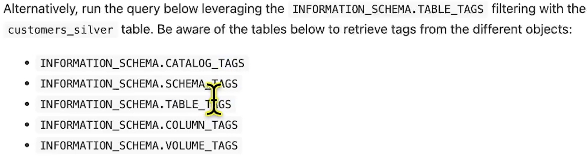

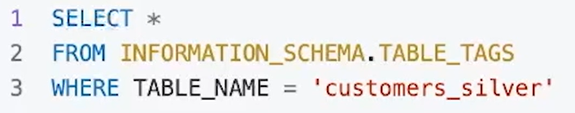

# Lineage in Unity Catalog  
(Concise Databricks Professional Exam Summary)

## 1. Purpose of Data Lineage
Data lineage is a **core pillar of data governance**, enabling teams to understand **where data comes from**, **how it is transformed**, and **where it is used**.  
Unity Catalog provides built‑in lineage tracking directly in **Catalog Explorer**.

---

## 2. Upstream Lineage  
With **[Upstream](ca://s?q=Explain_upstream_lineage_in_Unity_Catalog)** selected, you can see:
- Objects that **produced** or **fed into** the selected object  
- Tables, views, pipelines, or notebooks that **this object depends on**  
- Useful for **tracing data sources**, debugging, and validating data provenance

---

## 3. Downstream Lineage  
With **[Downstream](ca://s?q=Explain_downstream_lineage_in_Unity_Catalog)** selected, you can see:
- Objects that **consume** or **depend on** the selected object  
- Dashboards, ML models, tables, or jobs that use this data  
- Essential for **impact analysis** before making schema or logic changes

---

## 4. Lineage Graph  
Unity Catalog provides a **visual lineage graph** that shows:
- Upstream and downstream relationships  
- Transformations and dependencies  
- Cross‑workspace and cross‑language lineage (SQL, Python, R, Scala)

This visualization helps teams understand complex pipelines at a glance.

---

## 5. Accessing Lineage in Catalog Explorer  
To view lineage for a table (e.g., `customers_silver`):

1. Open **Catalog Explorer**  
2. Select the table  
3. Navigate to the **Lineage** tab  
4. Click **See lineage graph** to open the full visualization

Note: Some catalog or schema names in examples may differ from your environment.

---

## Exam‑Ready Takeaway  
Unity Catalog lineage provides **end‑to‑end visibility** into data flow:
- **Upstream** → where data comes from  
- **Downstream** → who uses it  
- **Graph view** → intuitive visualization for governance, debugging, and impact analysis  

Lineage is essential for compliance, reliability, and safe evolution of data pipelines.

## Pseudonymization & Anonymization

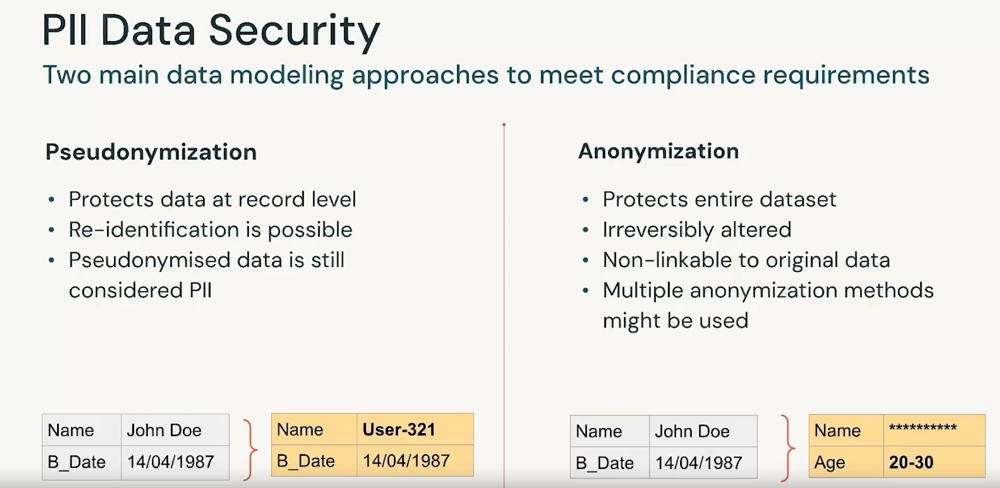

# Pseudonymization & Anonymization  
(Concise Databricks Professional Exam Summary)

# 1. Pseudonymization — Overview
- **[Replaces identifiable data](ca://s?q=Explain_pseudonymization_in_data_platforms)** with a pseudonym that can be re‑identified later.  
- Only **authorized users** can access the keys, salts, or lookup tables needed for re‑identification.  
- Protects data **at the record level**, making it suitable for **machine learning** and analytics.  
- A pseudonym is **still considered personal data under GDPR**.  
- Two main methods: **hashing** and **tokenization**.

---

# 2. Pseudonymization Method: Hashing
- Apply **SHA or other cryptographic hash** to PII fields.  
- Add a **random salt** before hashing to prevent reverse‑engineering.  
- Salt can be stored securely using **Databricks secrets**.  
- Increases data size and may reduce performance for some operations.  
- Deterministic hashing enables **joins** and **grouping** on pseudonymized fields.

---

# 3. Pseudonymization Method: Tokenization
- Converts PII into **tokens** stored in a secure lookup table.  
- Lookup table enables **controlled re‑identification**.  
- **Slow to write**, but **fast to read**.  
- Tokenized data often uses **fewer bytes** than hashed data.  
- Useful when reversible pseudonymization is required.

---

# 4. Anonymization — Overview
- Protects **entire datasets** (tables, schemas, catalogs).  
- Data is **irreversibly altered**, preventing direct or indirect identification.  
- Commonly used for **Business Intelligence** and broad analytics.  
- Often combines multiple techniques in real‑world scenarios.  
- Two main methods: **data suppression** and **generalization**.

---

# 5. Anonymization Method: Data Suppression
- Remove or hide PII columns from views.  
- Remove rows where demographic groups are too small (avoid re‑identification).  
- Use **dynamic access controls** to conditionally expose full data.  
- Supports privacy while maintaining analytical utility.

---

# 6. Anonymization Method: Generalization
Generalization reduces precision while keeping analytical value.

### Types of Generalization
- **Categorical generalization**  
  - Replace specific categories with broader ones.  
  - Example: “Amsterdam → The Netherlands → Europe”.

- **Binning**  
  - Group numeric values into ranges.  
  - Useful for demographic analysis without exposing individuals.

- **Truncating IP addresses**  
  - Apply /24 CIDR: replace last byte with `0`.  
  - Generalizes geolocation to city or neighborhood level.

- **Rounding**  
  - Round numeric values to reduce precision.

---

# Exam‑Ready Takeaway
- **Pseudonymization** → reversible, record‑level protection (hashing, tokenization).  
- **Anonymization** → irreversible, dataset‑level protection (suppression, generalization).  
- GDPR treats pseudonymized data as **still personal**, but anonymized data as **non‑personal**.  
- Databricks supports both approaches through secure storage, secrets, governance, and dynamic access controls.

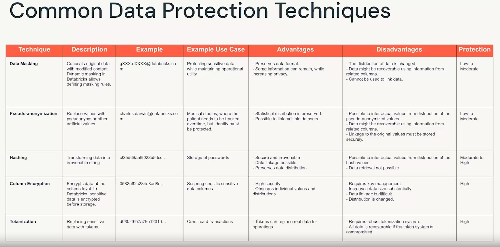

# Best Practices for Handling PII Data  
(Concise Databricks Professional Exam Summary)

## 1. **[Avoid PII When Possible](ca://s?q=Why_avoiding_PII_is_best_practice)**
The safest PII is the PII you never collect. Minimizing collection reduces risk, compliance burden, and attack surface.

## 2. **[Prefer Anonymization > Pseudonymization > Cleartext](ca://s?q=Anonymization_vs_Pseudonymization_best_practices)**
Anonymization is irreversible and safest.  
Pseudonymization is reversible and still considered personal data under GDPR.  
Cleartext PII should be avoided unless absolutely necessary.

## 3. **[Maintain Healthy Paranoia](ca://s?q=Data_security_paranoia_best_practices)**
Always assume protections can fail. Regularly review controls, access paths, and potential misuse scenarios.

## 4. **[Apply the “3 Facts Rule”](ca://s?q=Explain_the_3_facts_rule_for_reidentification)**
If three independent facts can identify a person, the dataset is at re‑identification risk.  
Use this rule to evaluate anonymization strength.

## 5. **[Consider Dataset Combinations](ca://s?q=Reidentification_risk_dataset_combination)**
Even anonymized datasets can become identifiable when joined with external or internal data sources.

## 6. **[Train Data Teams on Privacy Laws](ca://s?q=Training_data_teams_on_GDPR_and_CCPA)**
Ensure engineers, analysts, and ML teams understand GDPR, CCPA, and internal privacy policies.

## 7. **[Recognize PII Sensitivity Levels](ca://s?q=PII_sensitivity_levels)**
Not all PII is equal—financial, health, and biometric data require stronger controls than basic identifiers.

## 8. **[Conduct PIIR Reviews](ca://s?q=PII_risk_review_process)**
PII Risk Reviews help validate controls, identify gaps, and ensure compliance before data moves to production.

## 9. **[Isolate Environments Processing PII](ca://s?q=Isolating_PII_processing_environments)**
Use separate workspaces, networks, and compute clusters for PII workloads to reduce blast radius.

## 10. **[Isolate Environments Protecting PII](ca://s?q=Environment_isolation_for_PII_protection)**
Keep the environment that stores or protects PII separate from analytics or ML environments.  
This simplifies governance and reduces accidental exposure.

---

## Exam‑Ready Takeaway
- **Minimize PII**, anonymize whenever possible, and treat pseudonymized data as still sensitive.  
- **Think like an attacker**: assume datasets can be combined or leaked.  
- **Train teams**, **review risks**, and **isolate environments** to maintain strong privacy posture.

If you want, I can also create a **cheat sheet**, **flashcards**, or a **side‑by‑side comparison** of anonymization vs pseudonymization.

# Streaming Data and Data Changes  
(Concise Databricks Professional Exam Summary)

## 1. Structured Streaming and Data Changes
- Structured Streaming treats an input stream as a **continuously appended table**.  
- It expects **append‑only** data sources.  
- **Updates and deletes break this assumption**, because the engine does not expect previously written data to change.  
- To handle changes, you need **deduplication logic** to detect updated or deleted records.  
- Delta Lake tracks **files**, not rows — updating one row rewrites the entire file and creates a **new version**.

---

# Solution 1: Ignore Changes  
Use Delta options to **skip updates, deletes, and overwrites** so the stream only processes new inserts.

## 2. Skip Change Commits  
**[Skip Change Commits](ca://s?q=Delta_skipChangeCommits_explanation)** ignores any transaction that modifies or deletes existing data.

- Returns **only inserted rows**  
- Ignores updates, deletes, and overwrites  
- Includes behavior of `ignoreDeletes`

### Example
```sql
spark.readStream
  .format("delta")
  .option("skipChangeCommits", "true")

```
# Ignore Deletes

`Ignore Deletes` ignores delete operations at partition boundaries.

## Key Points

- Ignores delete transactions
- No new data files are written when entire partitions are removed
- Useful when deletes are not relevant to downstream consumers

## Example

```sql
ALTER TABLE sales_table
SET TBLPROPERTIES (
  'write.delete.mode' = 'ignore'
);

spark.readStream
  .format("delta")
  .option("ignoreDeletes", "true")
```

# Exam-Ready Takeaway

- Structured Streaming expects append-only data.
- Updates/deletes require deduplication or change-handling strategies.
- `skipChangeCommits` → ignores updates, deletes, and overwrites.
- `ignoreDeletes` → ignores delete operations only.
- Delta logs track files, so any row change rewrites a file and creates a new version.

## Next Topics

- Solution 2: Apply Changes
- Solution 3: Use MERGE in Streaming


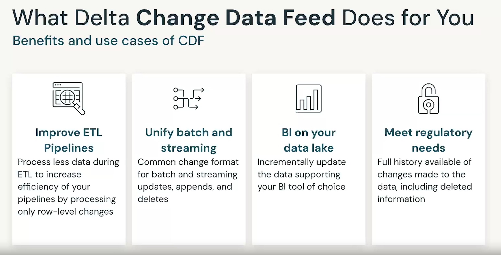
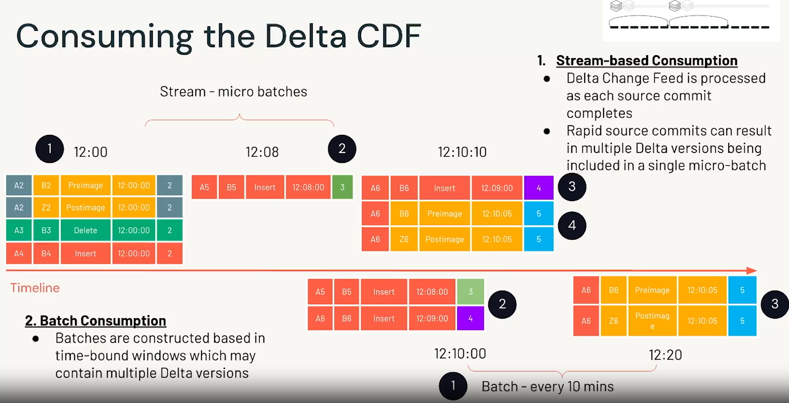

# Change Tables Function (Delta Lake CDF)  
(Concise Databricks Professional Exam Summary)

## 1. Purpose  
The **Change Tables** function (`table_changes`) returns **row‑level changes** between versions of a Delta table that has **Change Data Feed (CDF)** enabled.

It captures:
- **Inserts**
- **Deletes**
- **Updates** (both *pre‑image* and *post‑image*)

This allows downstream systems to consume only what changed instead of scanning entire tables.

---

## 2. Metadata Columns  
The function exposes several important metadata fields:

- **_change_type** — Type of change  
  - `insert`  
  - `delete`  
  - `update_preimage`  
  - `update_postimage`

- **_commit_version** — Delta Lake commit version associated with the change

- **_commit_timestamp** — Timestamp of the commit

These fields allow consumers to track exactly *what* changed, *when*, and *how*.

---

## 3. Syntax  
```sql
table_changes(table_str, start [, end])
```

## Parameters

- `table_str` — Fully qualified table name
- `start` — Starting version or timestamp
- `end` *(optional)* — Ending version or timestamp

If `end` is omitted, changes are returned from `start` to the latest version.

```sql
SELECT * 
FROM table_changes('main.sales.orders', 10, 15);
```
This returns all row-level changes between version `10` and version `15`.

---

# Exam-Ready Takeaway

- `table_changes()` is the primary function for row-level CDC in Delta Lake.
- Requires **Change Data Feed (CDF)** to be enabled.
- Returns:
  - Inserts
  - Deletes
  - Update pre-images
  - Update post-images
- Metadata columns:
  - `_change_type`
  - `_commit_version`
  - `_commit_timestamp`
  
These provide full auditability and incremental change tracking.

# Data Deletion, CDF, and Compliance in Databricks  
(Concise Databricks Professional Exam Summary)

# 1. Data Deletion in Databricks  
Handling PII deletion requires **precision**, **auditability**, and **compliance awareness**.

## Key Principles
- Companies must process deletion requests carefully to comply with **GDPR** and **CCPA**.  
- PII must be **efficiently deleted** or obfuscated across all relevant tables.  
- Deletion workflows are typically **separate pipelines**, not part of standard ETL.  
- **[CDF](ca://s?q=How_to_use_CDF_for_PII_deletion)** can propagate delete actions to downstream tables.

---

# 2. Recording Important Data Changes  
Delta Lake supports **commit messages** for auditability.

## Commit Messages
- Stored in the **Delta transaction log**.  
- Visible in **DESCRIBE HISTORY**.  
- Useful for tracking why a change occurred.

### Commit messages can be:
- **Global defaults**  
- **Specified per write operation**  
  - Example: labeling inserts as *manual* or *automated*

This improves traceability for compliance and debugging.

---

# 3. Propagating Data Deletion with CDF  
CDF enables automated, reliable propagation of delete events.

## How It Works
- Structured Streaming can trigger workflows when delete events appear.  
- CDF identifies rows that must be **deleted or updated** in downstream tables.  
- Supports **automated PII deletion pipelines**.

### Important Note
Deleted PII still exists in:
- **Older table versions**  
- **CDF logs**  
- **Delta transaction history**

To physically remove PII, you must use **VACUUM**.

---

# 4. CDF Retention Policy  
CDF follows the **same retention policy** as the Delta table.

## Key Points
- Files are not physically removed until **VACUUM** runs.  
- VACUUM also deletes **CDF records**.  
- Default retention: **7 days** (safety window).  
- Delta prevents VACUUM with retention < 7 days unless you override the check.

### Steps to Force Immediate Deletion
1. Disable retention check:  
  
```sql
   SET spark.databricks.delta.retentionDurationCheck.enabled = false;
    VACUUM myTable DRY RUN;
    VACUUM myTable RETAIN 0 HOURS;
```
This is required for full PII erasure.

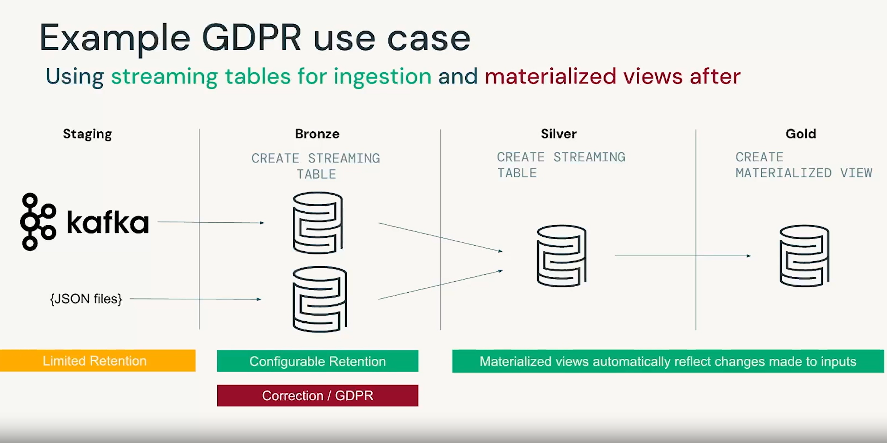
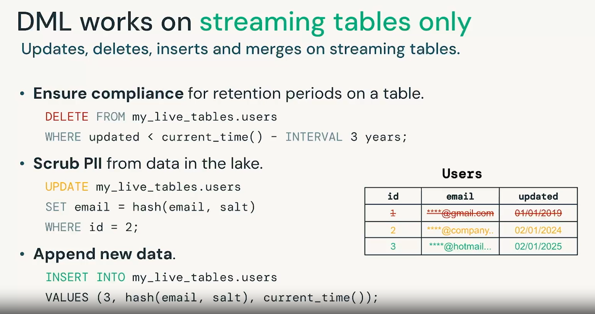
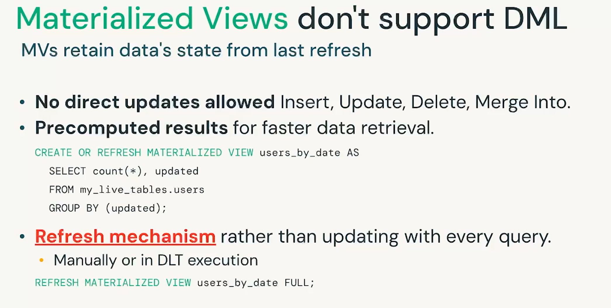

# Exam-Ready Takeaway

- PII deletion must be handled using dedicated pipelines with full auditability.
- Commit messages improve traceability and operational transparency.
- Change Data Feed (CDF) helps propagate deletions downstream but does **not** physically remove old PII data.
- `VACUUM` is required for permanent physical deletion of obsolete files.
- Retention policies and Delta safety checks must be clearly understood to maintain GDPR/CCPA compliance.

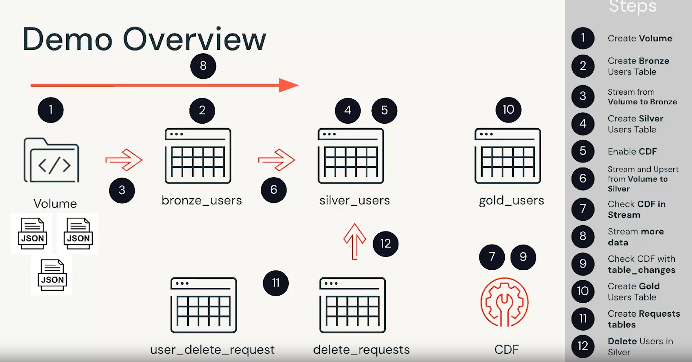


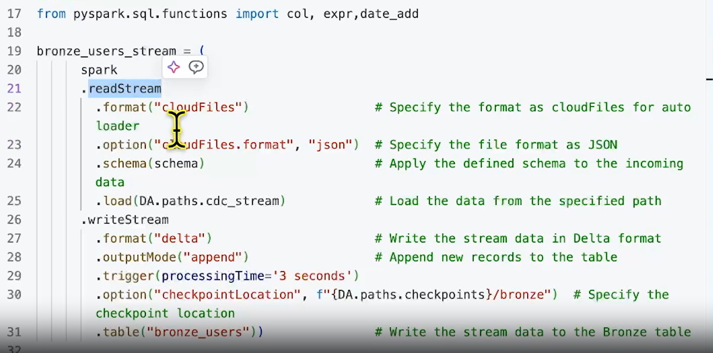
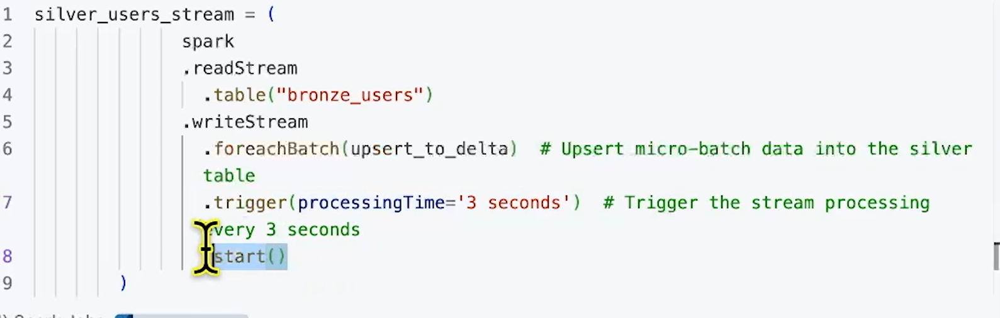

