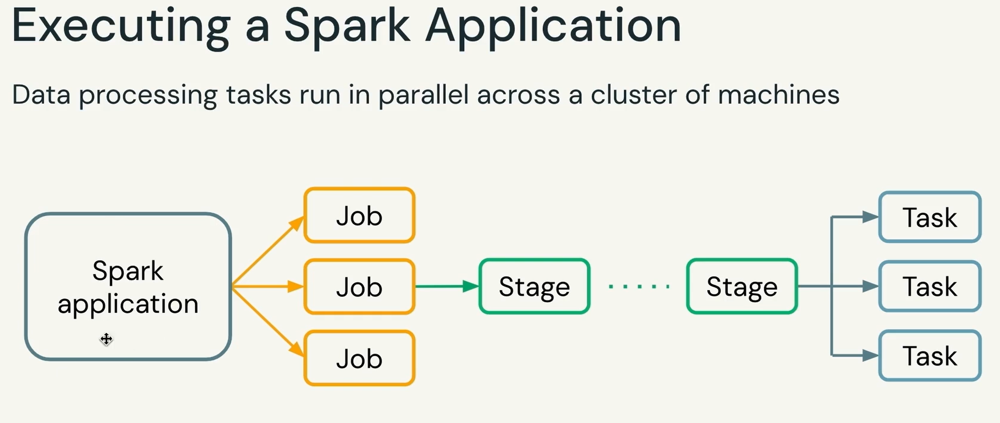
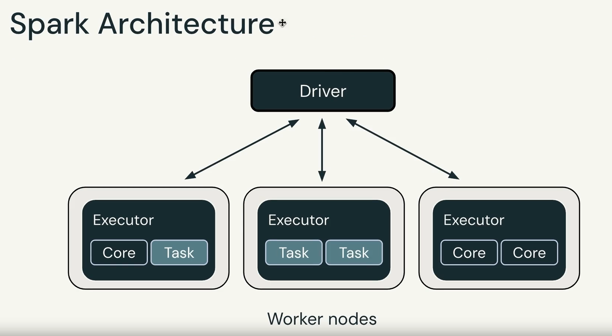
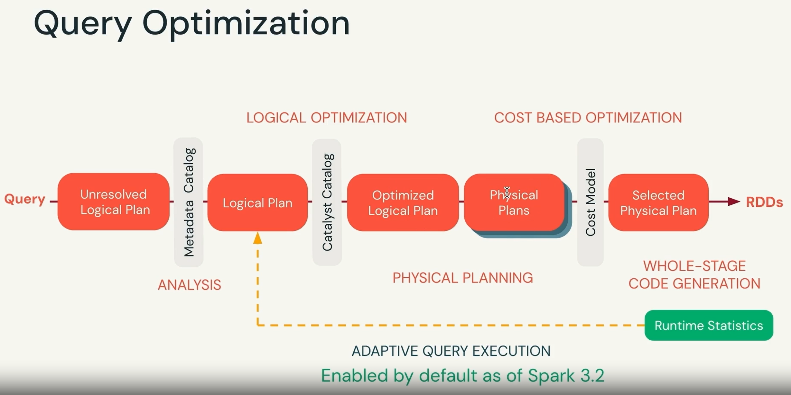

# Code Optimization Recommendations  
(Concise Databricks Professional Exam Summary)

## 1. **Use DataFrames or Datasets Instead of RDDs**  
RDDs cannot leverage the **Catalyst optimizer** or **Tungsten execution engine**, which means:
- No cost‑based optimization  
- No predicate pushdown  
- No automatic optimization of joins, filters, or projections  

Using **[DataFrames](ca://s?q=Why_use_Spark_DataFrames_over_RDDs)** or **[Datasets](ca://s?q=Spark_Datasets_explained)** enables Spark to optimize your code automatically.

---

## 2. **Avoid Unnecessary Actions in Production Jobs**  
Actions like:
- `count()`  
- `collect()`  
- `display()`  
- `show()`  

…force Spark to **materialize the entire plan**, triggering expensive jobs.

Use actions only when required for:
- Validations  
- Checkpointing  
- Writing output  

Otherwise, they slow down pipelines and increase cluster cost.

---

## 3. **Avoid Driver‑Heavy Operations**  
Operations that run on the **driver** instead of the cluster create bottlenecks.

Examples:
- Python loops  
- Pandas operations on the driver  
- Single‑threaded transformations  

Instead, use **[Pandas API on Spark](ca://s?q=Pandas_API_on_Spark_best_practices)** to distribute pandas‑style logic across the cluster.

### Benefits
- Parallel execution  
- No driver memory pressure  
- Better scalability for large datasets  

---

## Exam‑Ready Takeaway  
- Prefer **DataFrames/Datasets** → optimized by Catalyst.  
- Avoid unnecessary **actions** → they trigger full job execution.  
- Avoid **driver‑only** operations → use distributed APIs like Pandas API on Spark.

If you want, I can also produce a **Spark optimization cheat sheet**, **Catalyst optimizer summary**, or **common anti‑patterns list**.  

# Fundamental Concepts — Why Some Schemas and Queries Perform Faster  
(Concise Databricks Professional Exam Summary)

## 1. **[Number of Bytes Read](ca://s?q=Explain_bytes_read_impact_on_Spark_performance)**
The more data Spark must scan, the slower the query.  
Performance improves when:
- Tables are **partitioned effectively**  
- Columns are **pruned**  
- Files are **compacted** (OPTIMIZE)  
- Predicate pushdown reduces scanned data  

Minimizing bytes read is the **single biggest factor** in query speed.

---

## 2. **[Query Complexity / Computation](ca://s?q=Query_complexity_in_Spark)**  
Complex queries require more CPU, memory, and shuffle.  
Examples of expensive operations:
- Wide aggregations  
- Joins on skewed keys  
- Window functions  
- UDFs (especially Python UDFs)  

Simpler logic → fewer stages → faster execution.

---

## 3. **[Number of Files Accessed](ca://s?q=Small_files_problem_in_Delta_Lake)**  
Too many small files cause:
- Excessive task scheduling  
- High metadata overhead  
- Slow scans  

Optimizations:
- **OPTIMIZE** to compact files  
- **Auto Compaction**  
- **Optimize Write**  

Fewer, larger files = better throughput.

---

## 4. **[Parallelism](ca://s?q=Spark_parallelism_best_practices)**  
Spark is fast when work is **distributed** across many tasks.  
Performance depends on:
- Number of partitions  
- Cluster size  
- File sizes  
- Shuffle parallelism  

Under‑parallelization → slow jobs.  
Over‑parallelization → overhead and wasted resources.

---

## Exam‑Ready Takeaway
Query performance is driven by four fundamentals:
- **Bytes read**  
- **Query complexity**  
- **File count**  
- **Parallelism**

Optimizing these factors leads to faster, more efficient Databricks workloads.

If you want, I can also create a **performance tuning cheat sheet** or a **Spark optimization decision tree**.  


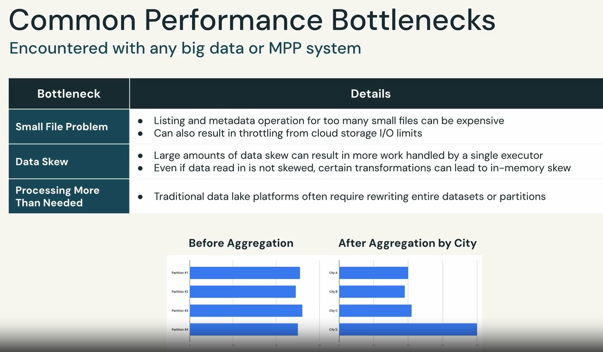

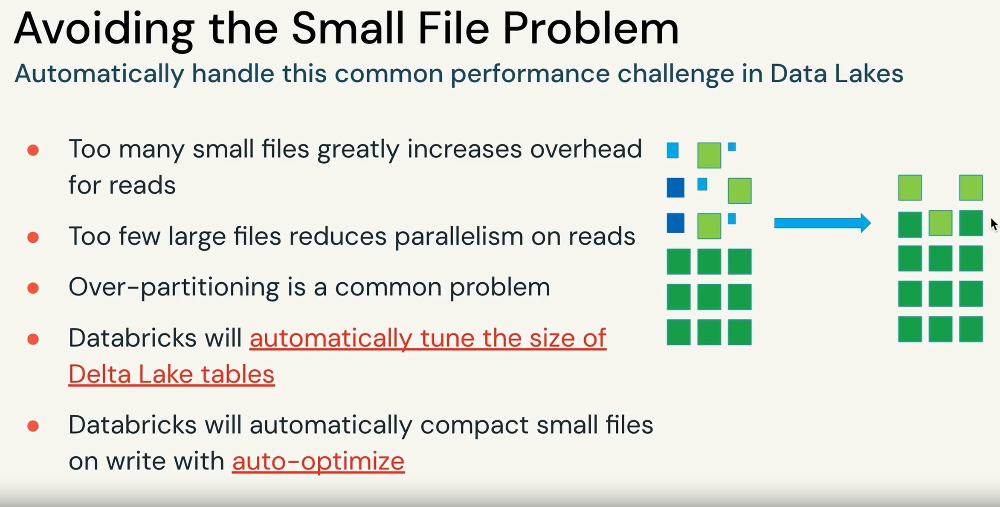

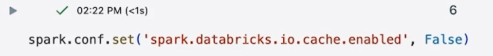

# File Explosion — Key Concepts & Best Practices  
(Concise Databricks Professional Exam Summary)

## 1. **[Avoid Over‑Partitioning](ca://s?q=Avoid_over_partitioning_in_Delta_Lake)**
Partitioning on **high‑cardinality columns** (e.g., unique IDs) creates:
- Thousands or millions of tiny partitions  
- Excessive metadata  
- Slow query planning  
- Inefficient scans  

This is the classic **file explosion** problem.

---

## 2. **[Unique‑Value Partitioning Is Harmful](ca://s?q=Why_not_partition_by_unique_ID)**
Partitioning by columns where **each row has a unique value** results in:
- One file per row or per micro‑batch  
- Extremely slow queries  
- Inefficient storage layout  
- Poor parallelism  

Spark cannot optimize when every partition contains almost no data.

---

## 3. **[Disable Caching to See True Performance](ca://s?q=Spark_caching_and_partitioning_effects)**
Caching can hide the negative effects of bad partitioning.  
Disabling caching helps you:
- Observe real scan performance  
- Understand file‑level inefficiencies  
- Measure the impact of partitioning strategies  

This is especially important during benchmarking.

---

## 4. **[Large Datasets Amplify the Problem](ca://s?q=Large_dataset_partitioning_best_practices)**
With datasets like **50 million rows**, improper partitioning can:
- Multiply the number of files  
- Increase job duration dramatically  
- Overwhelm the driver with metadata  
- Reduce cluster parallelism  

The larger the dataset, the more critical proper partitioning becomes.

---

## 5. **[Liquid Clustering Mitigates File Explosion](ca://s?q=Databricks_liquid_clustering_explained)**
Databricks **Liquid Clustering** provides:
- Automatic clustering based on chosen columns  
- Continuous optimization of data layout  
- Reduction of small files  
- Improved skipping and scan efficiency  

It solves many of the problems caused by over‑partitioning while keeping data layout flexible.

---

## Exam‑Ready Takeaway
- Over‑partitioning → file explosion → slow queries.  
- Never partition by high‑cardinality or unique‑value columns.  
- Disable caching to evaluate true performance.  
- Large datasets magnify partitioning mistakes.  
- Liquid Clustering is the modern solution to avoid small‑file issues.

If you want, I can also create a **partitioning strategy cheat sheet** or a **Liquid Clustering vs classic partitioning comparison**.  


## Data Skipping
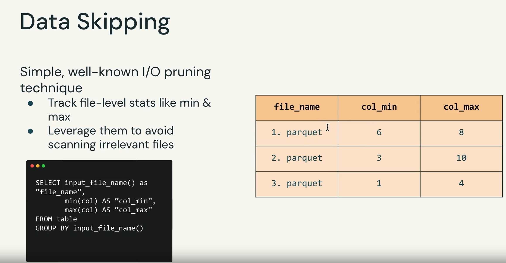
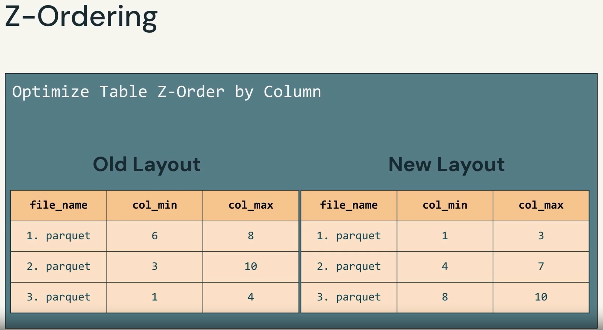
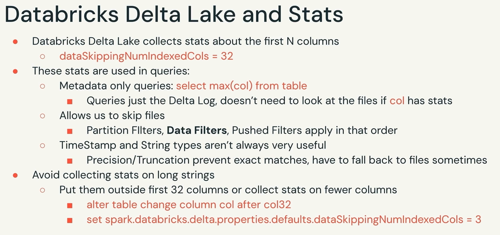
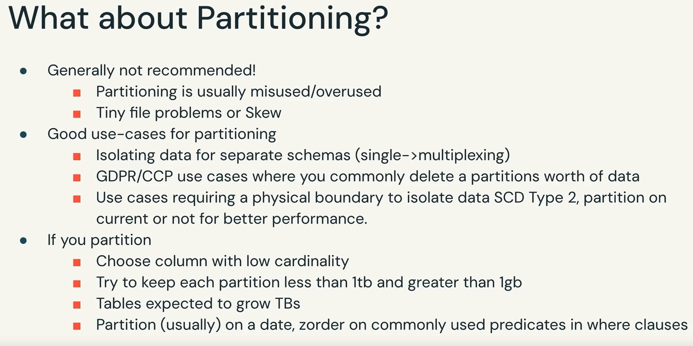

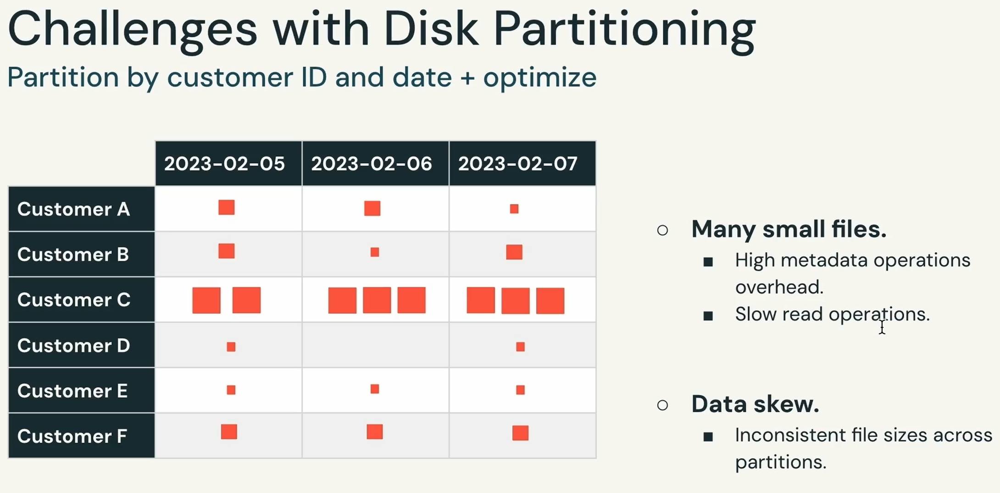
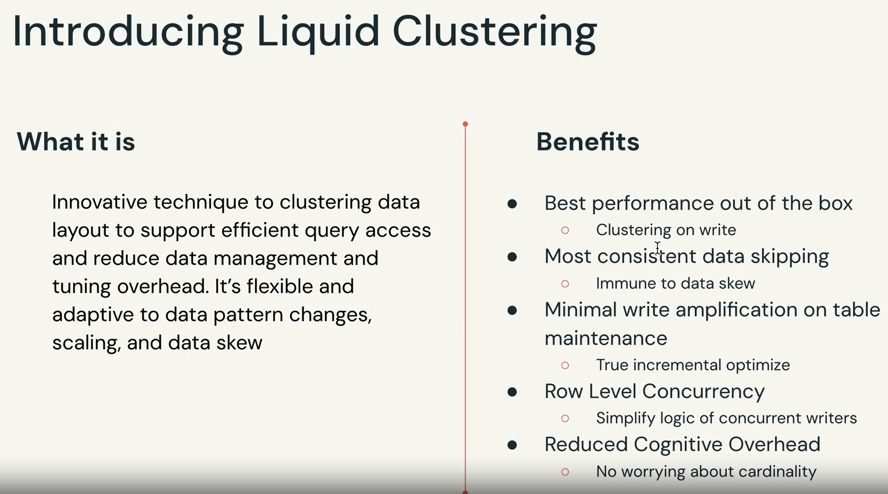

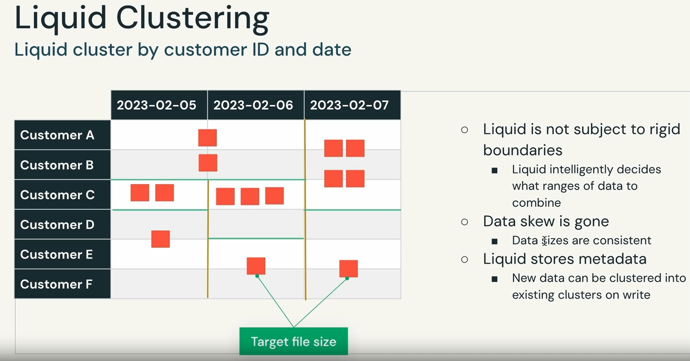

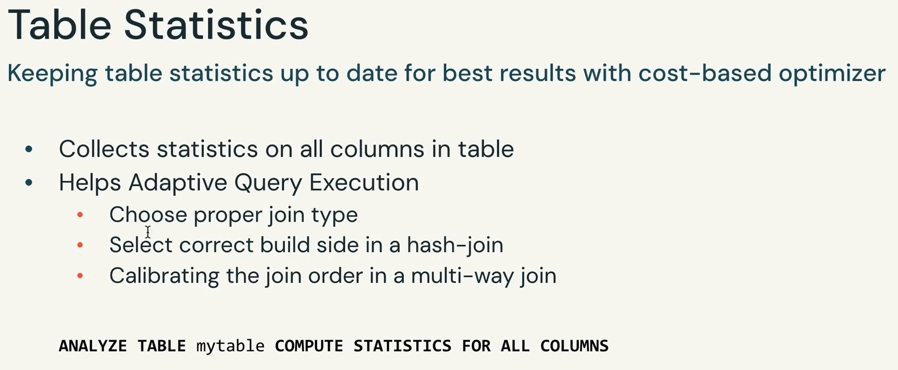
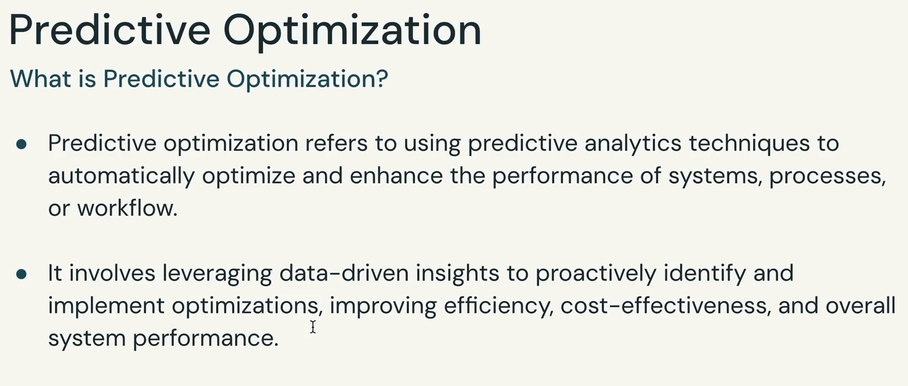

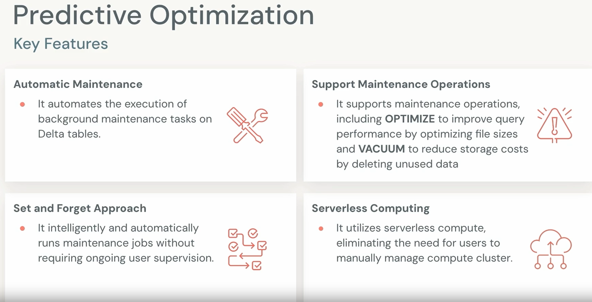

## Code Optimization
# Spark Performance Optimization

- Optimize Spark code to improve query performance and execution efficiency.
- Identify and troubleshoot bottlenecks such as:
  - Data skew
  - Excessive shuffles
  - Spill to disk
  - Serialization overhead
- Apply proactive optimization strategies:
  - Predicate pushdown
  - Broadcast joins
  - Proper partitioning
  - Efficient caching
  - File compaction and Z-Ordering
- Use Adaptive Query Execution (AQE) to dynamically optimize execution plans at runtime:
  - Skew join handling
  - Dynamic partition coalescing
  - Automatic join strategy optimization

### Skew
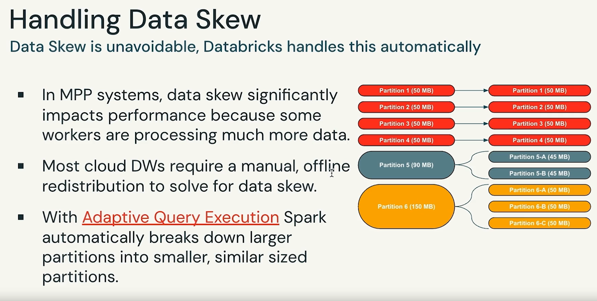

# Skew Mitigation in Spark  
(Concise Databricks Professional Exam Summary)

## Common Solutions for Data Skew

### 1. Adaptive Query Execution (AQE)
- Enabled by default in Spark 3.1+
- Automatically detects and mitigates skewed partitions at runtime
- Can split large skewed partitions into smaller tasks
- Preferred modern solution for skew handling

---

### 2. Filter Skewed Values
- Identify heavily skewed keys and filter or process them separately
- Useful when a small number of values dominate the dataset
- Helps reduce shuffle imbalance and executor stragglers

---

### 3. Databricks Skew Hint
- Proprietary Databricks optimization hint
- Easier than manually salting keys
- Especially useful in Spark 2.x environments
- Helps Spark optimize skewed joins automatically

Example:
```sql
SELECT /*+ SKEW('customer_id') */ *
FROM orders o
JOIN customers c
ON o.customer_id = c.customer_id;
```
**4. Salting Join Keys**
- Used when other mitigation strategies are insufficient
- Adds random suffixes (salt values) to skewed keys
- Forces more even data distribution during shuffle

Example approach:

Original key:
- customer_1

Salted keys:
- customer_1_0
- customer_1_1
- customer_1_2

Benefits:

Breaks large skewed partitions into smaller partitions
Improves parallelism and reduces stragglers

Tradeoff:

Adds implementation complexity
Requires corresponding salting on both join sides

Exam-Ready Takeaway
Data skew causes uneven partition sizes and long-running tasks.
Preferred mitigation order:
- AQE
- Filter skewed values
- Databricks skew hint
- Salting keys (last resort)
- Salting distributes skewed keys more evenly across partitions during shuffle.

## Shuffle

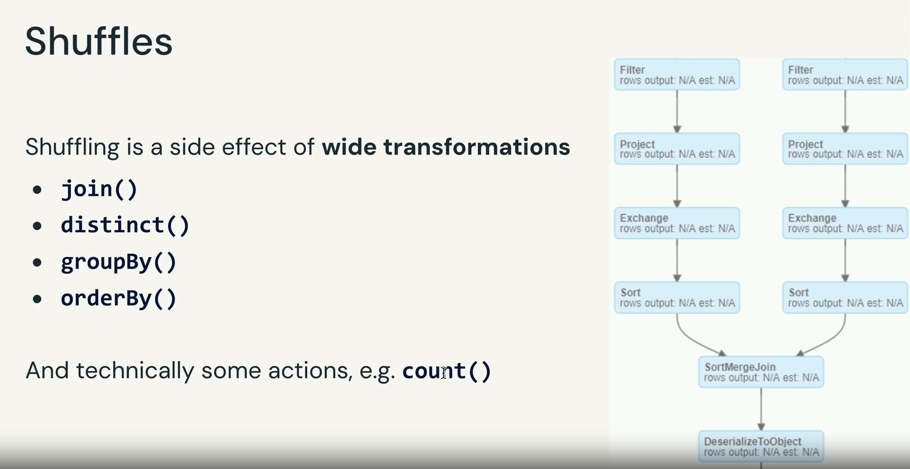
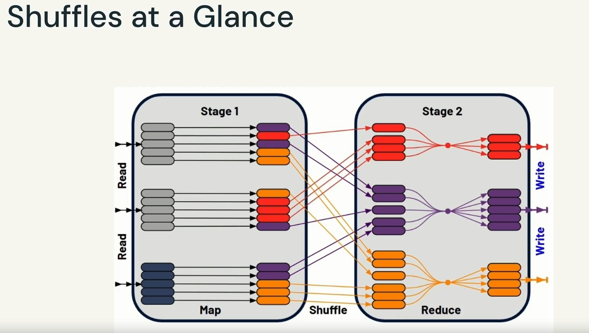
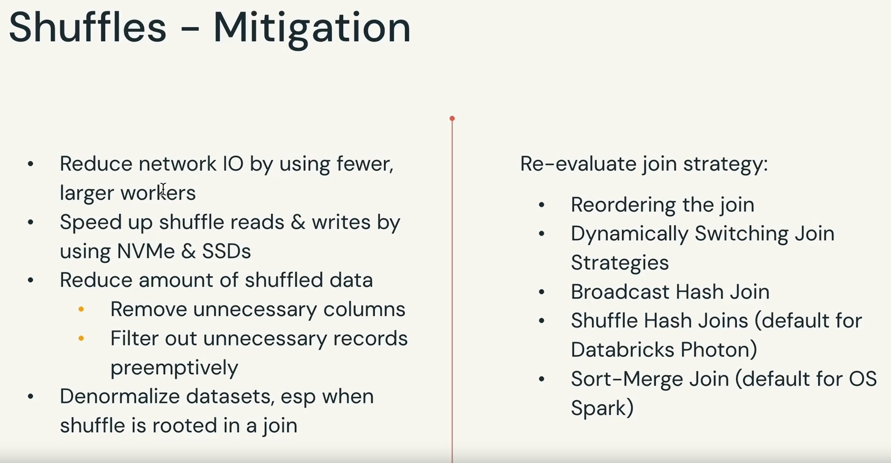


## Spill
# Spill — What It Is and Why It Slows Down Spark  
(Concise Databricks Performance Summary)

## 1. **[What Spill Means](ca://s?q=Explain_Spark_spill)**
Spill occurs when Spark **runs out of RAM** for a given partition and is forced to:
- Move data **from memory → disk**
- Later reload it **from disk → memory**

This prevents **OOM errors**, but disk I/O is far slower than RAM, so performance drops significantly.

---

## 2. **[Why Spill Happens](ca://s?q=Causes_of_Spark_spill)**  
Spill is triggered when a partition becomes too large to fit in memory.  
Common causes include:

- **Setting `spark.sql.files.maxPartitionBytes` too high**  
  (default: 128 MB; too large → oversized partitions)

- **Exploding arrays**  
  Even small arrays can multiply rows dramatically.

- **Joins or crossJoins that generate huge row counts**

- **Joins on skewed keys**  
  One key produces a massive partition.

- **groupBy on low‑cardinality columns**  
  Few groups → huge partitions.

- **countDistinct() or size(collect_set())**  
  These operations build large in‑memory structures.

- **Setting `spark.sql.shuffle.partitions` too low**  
  Too few shuffle partitions → oversized partitions.

- **Incorrect use of `repartition()`**  
  Can accidentally create very large partitions.

---

## 3. **[Spill in Spark UI](ca://s?q=Spark_UI_spill_metrics)**  
Spark UI shows two spill metrics:

### **Spill (Memory)**  
- Size of the partition **before** spilling  
- Represents how much data could not fit in RAM

### **Spill (Disk)**  
- Size of the spilled data **after serialization**  
- Always smaller due to compression during serialization

These two values always appear together.

---

## 4. **[Mitigations](ca://s?q=How_to_reduce_Spark_spill)**  
To reduce or eliminate spill:

- **Allocate clusters with more RAM per core**  
  More memory → fewer spills.

- **Address data skew**  
  Use salting, repartitioning, or AQE skew join handling.

- **Manage partition sizes**  
  Tune:
  - `spark.sql.files.maxPartitionBytes`
  - `spark.sql.shuffle.partitions`

- **Avoid expensive operations like explode()**  
  Or pre‑filter before exploding.

- **Reduce data early**  
  Apply filters, projections, and pruning before heavy operations.

---

## Exam‑Ready Takeaway
- Spill = Spark running out of RAM and writing to disk.  
- It is slow but prevents OOM failures.  
- Caused by large partitions, skew, expensive operations, or poor configuration.  
- Mitigate by increasing memory, fixing skew, tuning partitions, and reducing data early.

If you want, I can also create a **Spark spill troubleshooting checklist** or a **partition tuning cheat sheet**.  

# Performance Problems with Serialization  
(Concise Databricks Professional Exam Summary)

## 1. Why Serialization Hurts Performance
Serialization becomes a bottleneck when using **UDFs**, especially Python UDFs.

### Key Reasons
- **[Spark SQL](ca://s?q=Spark_SQL_optimization_basics)** and **[DataFrame APIs](ca://s?q=Why_use_Spark_DataFrames)** are highly optimized and avoid unnecessary serialization.
- **UDFs must be serialized** and shipped to every executor.
- For every row:
  - Parameters must be **converted** into the UDF’s language type.
  - Return values must be **converted back** into Spark’s internal format.

### Python UDFs are the slowest because:
- Python code must be **pickled**.
- Each executor must start a **Python interpreter**.
- Every row must cross the **JVM ↔ Python** boundary.
- This conversion is extremely expensive at scale.

---

# 2. Mitigating Serialization Issues

## **1. Don’t Use UDFs (Best Practice)**
Use **built‑in functions** and **higher‑order functions** instead.  
They are:
- Optimized by Catalyst  
- Vectorized  
- Community‑maintained  
- Faster and safer  

You can express almost all transformations using:
- `transform()`
- `aggregate()`
- `filter()`
- `map_from_entries()`
- `explode()`
- `regexp_extract()`
- `from_json()`  
…and many more.

---

## **2. If You Must Use Python UDFs, Use Vectorized UDFs**
Prefer:
- **[Pandas UDFs](ca://s?q=Explain_Pandas_UDFs_in_Spark)**  
- **Apache Arrow optimized UDFs**

Benefits:
- Operate on **batches** instead of rows  
- Reduce serialization overhead  
- Use Arrow for fast data transfer  

---

## **3. If You Must Use Scala UDFs, Use Typed Transformations**
Typed APIs (e.g., `map`, `flatMap`, `mapPartitions`) avoid the overhead of:
- Generic UDF wrappers  
- Excessive serialization  

They integrate more naturally with Spark’s execution engine.

---

## **4. Avoid Using UDFs to Integrate Existing Business Logic**
It’s tempting to wrap legacy logic in a UDF, but:
- It kills performance  
- It bypasses Catalyst optimization  
- It increases maintenance cost  

**Porting business logic into Spark’s native functions almost always pays off.**

---

# Exam‑Ready Takeaway
- Serialization is expensive, especially with Python UDFs.  
- Built‑in functions are always faster than UDFs.  
- If UDFs are unavoidable, use **Pandas UDFs** or **typed Scala transformations**.  
- Avoid embedding business logic in UDFs—rewrite it using Spark‑native APIs.

If you want, I can also create a **UDF vs built‑in functions comparison table** or a **Spark serialization troubleshooting guide**.  


## Cluter Type

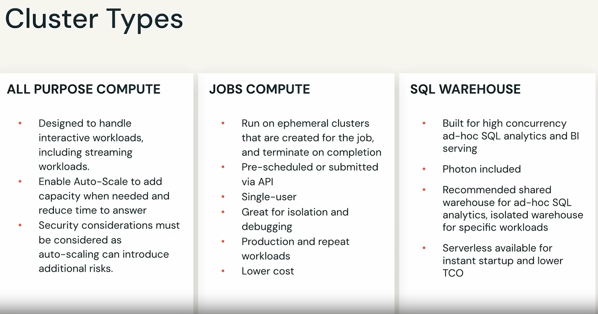
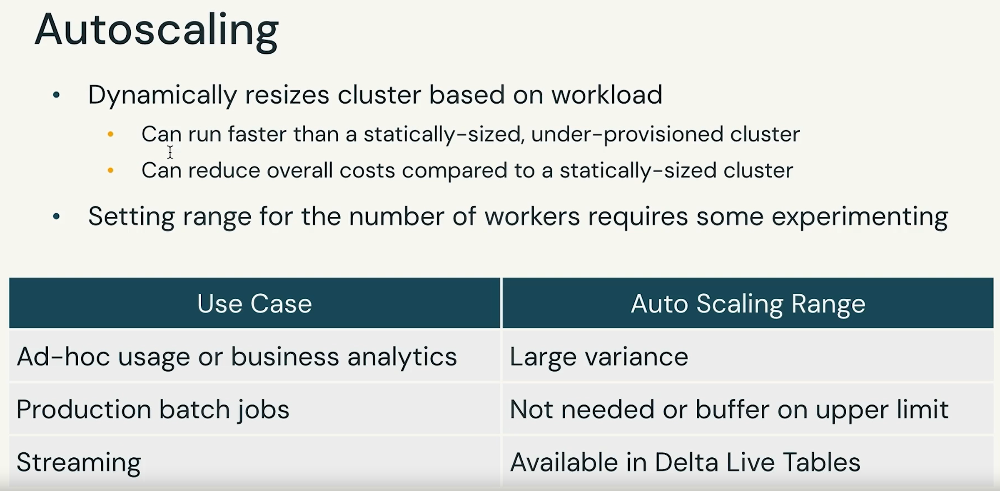
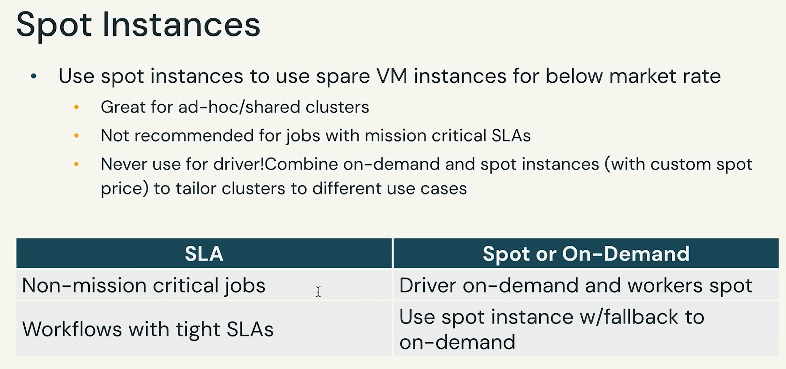
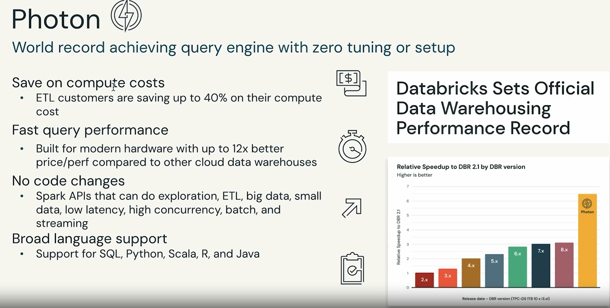

# Cluster Optimization Recommendations  
(Concise Databricks Professional Exam Summary)

## 1. DS & DE Development  
Use **[all‑purpose compute](ca://s?q=All_purpose_compute_best_practices)** with:
- **Auto‑scale** enabled  
- **Auto‑stop** enabled  
- Development and testing performed on a **subset of the data**  

This minimizes cost while supporting interactive development.

---

## 2. Ingestion & ETL Jobs  
Use **[jobs compute](ca://s?q=Databricks_jobs_compute_best_practices)**:
- Size clusters according to **job SLAs**  
- Prefer predictable, stable cluster sizing  
- Use job clusters for isolation and cost control  

---

## 3. Ad‑hoc SQL Analytics  
Use a **[serverless SQL warehouse](ca://s?q=Serverless_SQL_Warehouse_best_practices)**:
- Auto‑scale enabled  
- Auto‑stop enabled  
- Ideal for analysts running unpredictable workloads  

---

## 4. BI Reporting  
Use an **isolated SQL warehouse**:
- Sized according to **BI SLAs**  
- Prevents BI workloads from interfering with ETL or ad‑hoc analytics  

---

# Best Practices

## a. **Enable Spot Instances on Worker Nodes**  
Spot instances reduce cost significantly for non‑critical workloads.  
Use **on‑demand** for drivers to avoid instability.

---

## b. **Use the Latest LTS Databricks Runtime**  
Latest LTS runtimes provide:
- Better performance  
- Security patches  
- Improved stability  
- New features like optimized I/O and better AQE behavior  

---

## c. **Use Photon for Best TCO**  
Photon provides:
- Vectorized execution  
- Lower latency  
- Higher throughput  
- Better price/performance for SQL and ETL workloads  

Use Photon whenever supported by your workload.

---

## d. **Use Latest‑Generation VMs**  
Start with **general‑purpose** VMs, then test:
- **Memory‑optimized** for wide aggregations, joins, ML  
- **Compute‑optimized** for CPU‑heavy transformations  

Newer VM generations offer better performance per dollar.

---

# Exam‑Ready Takeaway
- Development → all‑purpose compute  
- ETL → jobs compute sized to SLA  
- Ad‑hoc analytics → serverless SQL  
- BI → isolated SQL warehouse  
- Best practices → spot workers, latest LTS runtime, Photon, modern VM families  

If you want, I can also create a **cluster sizing cheat sheet** or a **Photon vs non‑Photon comparison**.  

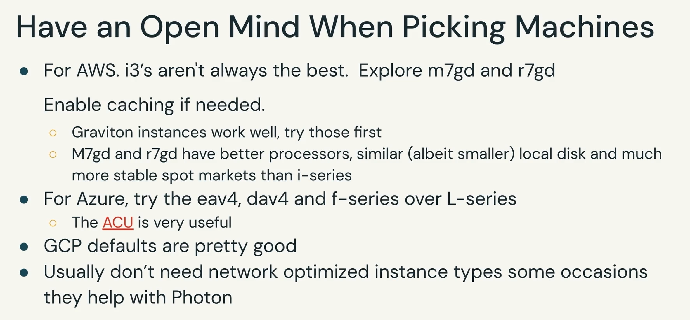
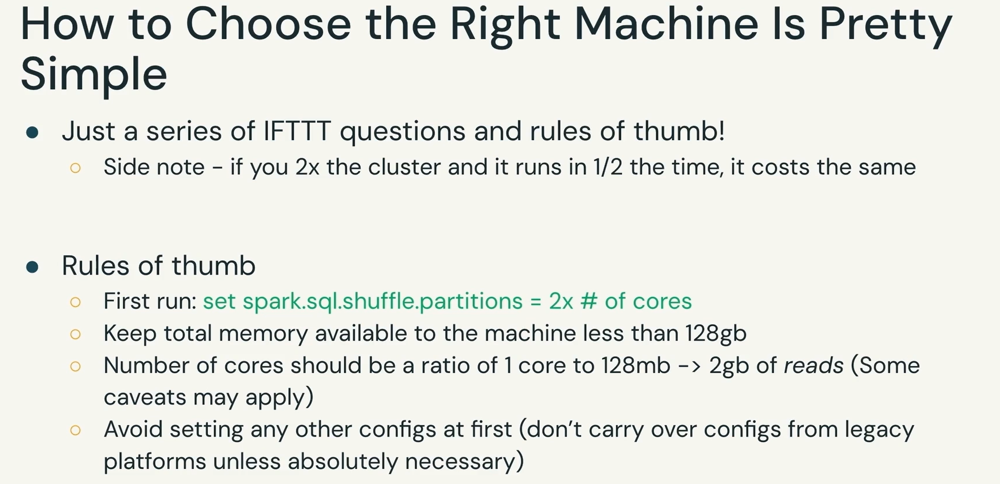
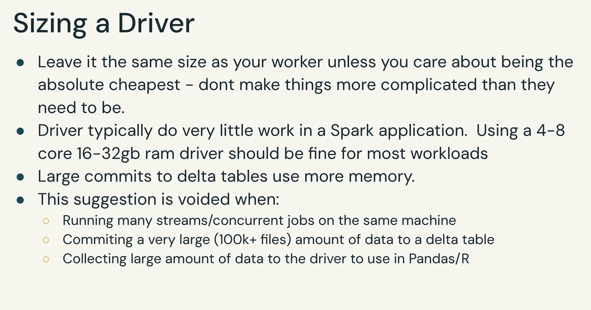
