# Stream Processing — Concise Summary (Databricks Professional Exam Style)

## 1. Why Stream Processing Matters
- Enables **real‑time analytics** on high‑velocity, continuously arriving data.
- Provides **lower latency**, **better fault tolerance**, and **more efficient resource usage** than batch processing.
- Critical for modern architectures involving IoT, clickstreams, financial transactions, and operational monitoring.

## 2. Core Architectural Components
- **Message Queues** (Kafka, Kinesis) — ingest and buffer events.
- **Processing Engines** (Apache Spark Structured Streaming) — perform incremental, stateful computations.
- **Storage Layers** (Delta Lake) — durable, ACID‑compliant storage for streaming outputs.
- **Databases / Serving Systems** — downstream consumers for analytics and applications.

## 3. Key Challenges in Stream Processing
- **Exactly‑once processing** despite failures.
- **Out‑of‑order / late data** based on event‑time.
- **Large state management** for aggregations and joins.
- **Load imbalance & stragglers** affecting throughput.
- **Incremental output updates** as new events arrive.
- **Transactional writes** to sinks without duplication or data loss.

## 4. How Spark Structured Streaming Solves These Challenges
- **Checkpointing + WAL** ensure exactly‑once guarantees.
- **Event‑time processing + watermarks** handle late and out‑of‑order data.
- **Stateful operations** with efficient state store management.
- **Adaptive execution** and scalable micro‑batch processing.
- **Delta Lake integration** for ACID transactions and idempotent writes.
- **Incremental processing model** simplifies building reliable real‑time pipelines.

## 5. Exam‑Ready Takeaway
Spark Structured Streaming provides a **declarative, fault‑tolerant, scalable** framework for real‑time data processing, addressing the core challenges of event‑time correctness, state management, and exactly‑once delivery through tight integration with Delta Lake.

## Introduction to Structured Streaming

# What Is Structured Streaming? (Concise Databricks Professional Exam Summary)

## 1. Definition
Structured Streaming is a **scalable**, **fault‑tolerant**, **declarative** stream processing framework built on the **Apache Spark SQL engine**. It treats streaming data as an **unbounded table**, enabling incremental processing using the same APIs as batch workloads.

## 2. Key Characteristics
- **Built on Spark SQL Engine** — leverages Catalyst optimizer and Tungsten execution engine.
- **Unified APIs** — uses the same **DataFrame** and **Spark SQL** APIs as batch processing.
- **End‑to‑end exactly‑once guarantees** — achieved through checkpointing, WAL, and idempotent sinks.
- **Fault tolerance** — automatic recovery from failures using persisted state and checkpoints.
- **Incremental execution model** — processes data in micro‑batches or continuous mode.

## 3. Why It Matters
- Simplifies real‑time pipeline development by reusing familiar batch APIs.
- Provides strong correctness guarantees for event‑time and stateful workloads.
- Integrates tightly with **Delta Lake** for ACID transactions and reliable streaming sinks.

## 4. Exam‑Ready Takeaway
Structured Streaming enables **reliable**, **exactly‑once**, **stateful**, and **scalable** real‑time processing using the same structured APIs as batch, powered by Spark’s optimized SQL engine.


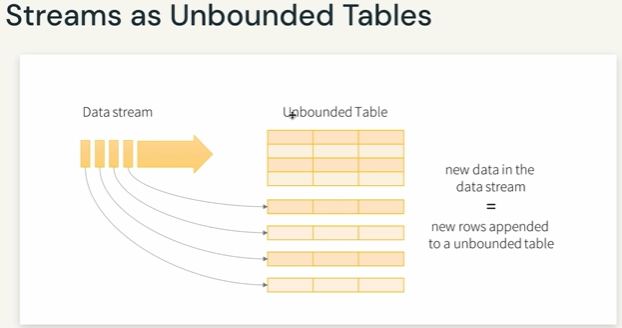

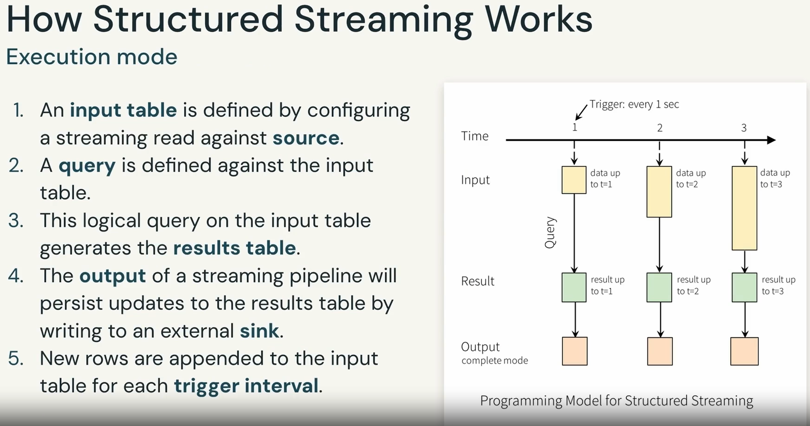

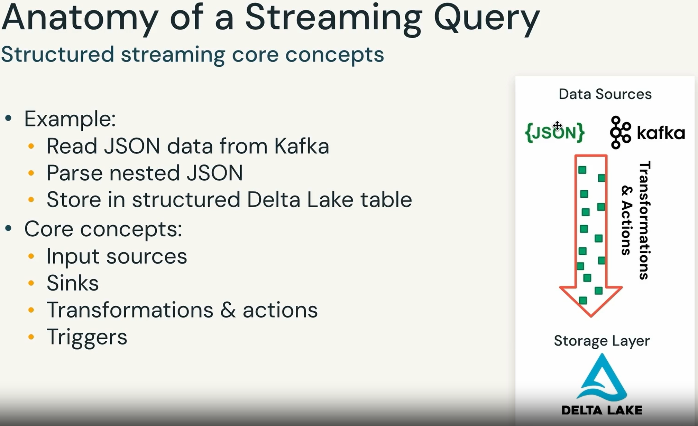

## Anatomy of a Streaming Query
### Structured streaming core concepts

**Source:**
- Specify where to read data from
- OS Spark supports Kafka and file sources
- Databricks runtimes include connector
- libraries supporting Delta, Event Hubs, and Kinesis

**Step -1**

```sql
spark.readStream.format(<source>)
.option(<>,<>) ...
.load()

spark.readStream.format("kafka")
option("kafka.bootstrap.servers", ... )
option("subscribe", "topic")
.load()

Returns a Spark DataFrame (common API for batch & streaming data)
```
**Step 2:** : **Transformations:**
- 100s of built-in, optimized SQL functions like from_json
- In this example, cast bytes from Kafka records to a string, parse it as JSON, and generate nested columns

```sql
.selectExpr("cast (value as string) as json")
.select(from_json("json", schema).as("data"))
```

**Step-3**

**SInk.** write transtormed output to external storage systems
- Databricks runtimes include connector library supporting Delta

**OS Spark supports:**
- Files and Kafka for production
- Console and memory for development and debugging
- foreachBatch to execute arbitrary code with the output data

```sql
.writeStream
.fçrmat("delta")
.option("path", "/deltaTable/")
```

**step -4 **

. **Checkpoint location:** For tracking the progress of the query

. **Output Mode:** Defines how the data is written to the sink; Equivalent to "save" mode on static DataFrames

. **Trigger:** Defines how frequently the input table is checked for new data; Each time a trigger fires, Sparks check for new data and updates the results

```sql
.trigger("1 minute")
.option("checkpointLocation", " ... ")
.start()
```

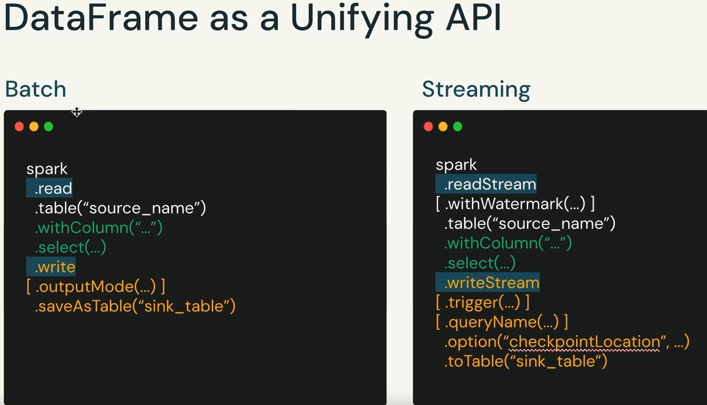

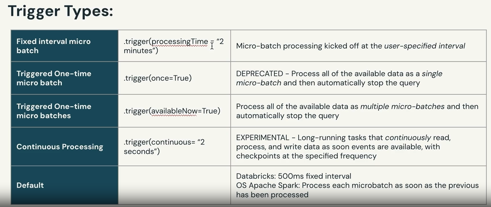

# Structured Streaming Output Modes (Concise Databricks Professional Exam Summary)

## 1. Overview
Output modes define **how results from the streaming Result Table are written to the sink** after each trigger. The supported modes depend on the **type of transformations** and the **sink**.

## 2. Output Modes

### **1. Append Mode**
- **Only new rows** added to the Result Table since the last trigger are written out.
- Requires that the query produces **only new, final rows** (e.g., event‑time windows with watermarks).
- Common for **append‑only** workloads.

### **2. Complete Mode**
- **The entire updated Result Table** is written to the sink on every trigger.
- Used when the query maintains **aggregated state** that must be fully output each time.
- Supported only by sinks that can handle full table rewrites.

### **3. Update Mode**
- Writes **new rows** and **rows that changed** since the last trigger.
- Suitable for stateful operations where partial updates are needed.
- Not all sinks support this mode.

## 3. Exam‑Ready Takeaway
- **Append** → only new rows  
- **Complete** → full table every trigger  
- **Update** → new + updated rows  
- Mode availability depends on **transformations** and **sink capabilities**.


**Batch**

```sql

Trom pyspark.sql.functions import col, approx_count_distinct, count

batch_df = (spark.read
    .load(DA.paths.events)
    .filter(col("traffic_source") == "email")
    .withColumn("mobile", col("device").isin(["i0S", "Android"]))
    .select("user_id", "event_timestamp", "mobile")

print(batch_df.isStreaming)

display(batch_df)
return : false
```

**Streaming**

```sql
from pyspark. sql.functions import col, approx_count_distinct, count

streaming_df = (spark. readStream. load(DA.paths.events)
        .filter(col("traffic_source") == "email")
        .withColumn("mobile", col("device").isin(["i0S", "Android"]))
        .select("user_id", "event_timestamp", "mobile")
)
print(streaming_df.isStreaming)
display(streaming_df, streamName = "display_user_d{vices")
```
**Output**

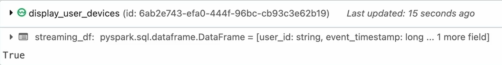

**Save to Sink**

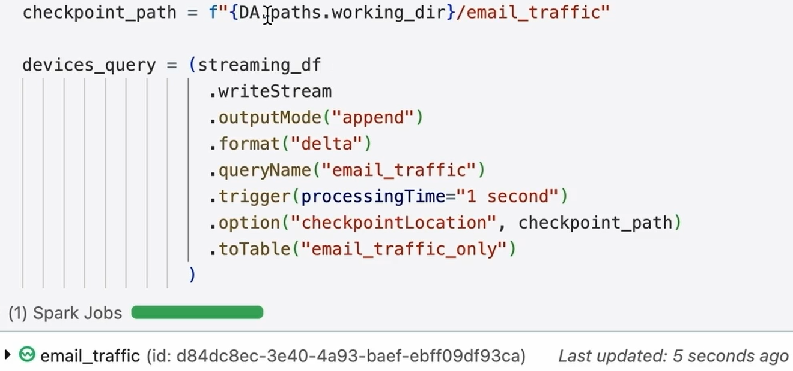

# Types of Stream Processing — Stateless vs. Stateful  
(Concise Databricks Professional Exam Summary)

## 1. Stateless Processing
- **Definition:** Each record is processed **independently**, with **no dependency** on previously seen data.
- **Characteristics:**  
  - No maintained state across triggers.  
  - Simple, high‑throughput operations.  
  - Easy to scale horizontally.
- **Examples:**  
  - **[Map‑only transforms](ca://s?q=Explain_map_only_transforms_in_streaming)** (e.g., parsing, filtering).  
  - **[Simple dimensional joins](ca://s?q=What_is_a_dimensional_join_in_streaming)** where the lookup table is static.

---

## 2. Stateful Processing
- **Definition:** Processing depends on **historical context** — previously seen records influence how new records are handled.
- **Characteristics:**  
  - Requires maintaining **state** across triggers.  
  - Used for aggregations, windows, and pattern detection.  
  - Needs checkpointing and state store management.
- **Examples:**  
  - **[Time‑based aggregations](ca://s?q=Explain_time_based_aggregations_in_streaming)** (e.g., windowed counts).  
  - **[Fraud / anomaly detection](ca://s?q=How_is_fraud_detection_done_in_streaming)** using event patterns over time.

---

## Exam‑Ready Takeaway
- **Stateless** → No history, simple transforms, no state store.  
- **Stateful** → Depends on prior events, used for windows, joins, and detection logic.

# Reasoning About Time in Structured Streaming  
(Concise Databricks Professional Exam Summary)

## 1. Event Time vs. Processing Time

### **Event Time**
- The timestamp **when the event actually occurred** at the source.  
- Used for **correct time‑based analytics**, especially when data arrives late or out of order.  
- Essential for **windowing**, **watermarking**, and **event‑time aggregations**.

### **Processing Time**
- The timestamp **when Spark processes the record**.  
- Depends on system load, network delays, and ingestion latency.  
- Easier to compute but **not reliable** for correctness in out‑of‑order or delayed data scenarios.

### **Exam‑Ready Insight**
Correctness in streaming depends on **event time**, not processing time, especially for unbounded and out‑of‑order data.

---

## 2. Time‑Based Windows

### **Tumbling Windows**  
- **Fixed‑size**, **non‑overlapping** windows.  
- Each event belongs to **exactly one** window.  
- Example windows:  
  - 1:00–2:00  
  - 2:00–3:00  
  - 3:00–4:00  
- Common for periodic aggregations (hourly counts, daily summaries).

### **Sliding Windows**  
- **Fixed‑size**, **overlapping** windows.  
- Each event may appear in **multiple** windows.  
- Example windows:  
  - 1:00–2:00  
  - 1:30–2:30  
  - 2:00–3:00  
- Useful for rolling metrics (moving averages, anomaly detection).

---

## Exam‑Ready Takeaway
- **Event Time** → actual occurrence time; required for correctness.  
- **Processing Time** → system processing time; may cause inaccuracies.  
- **Tumbling Window** → no overlap, one window per event.  
- **Sliding Window** → overlapping windows, event appears in multiple windows.


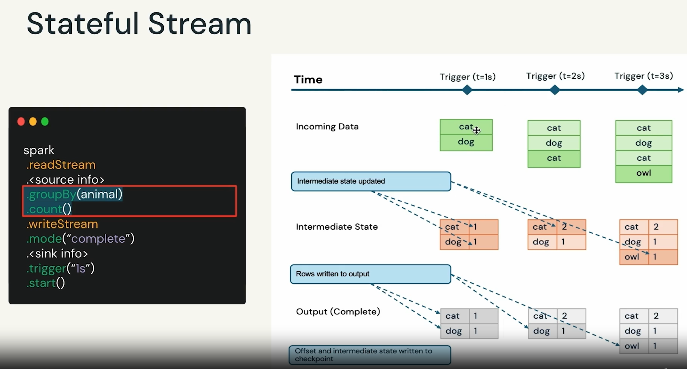
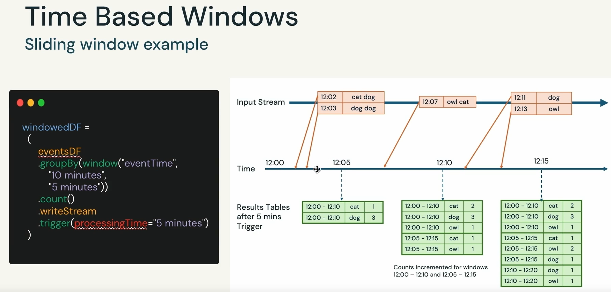
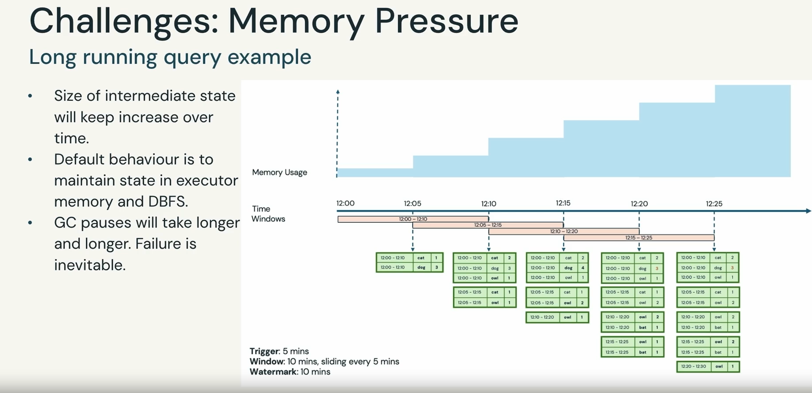
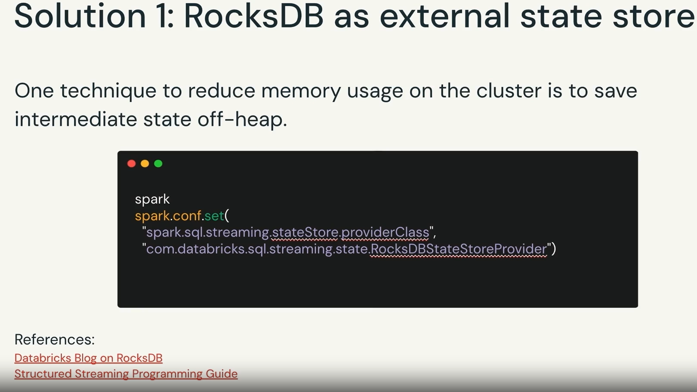
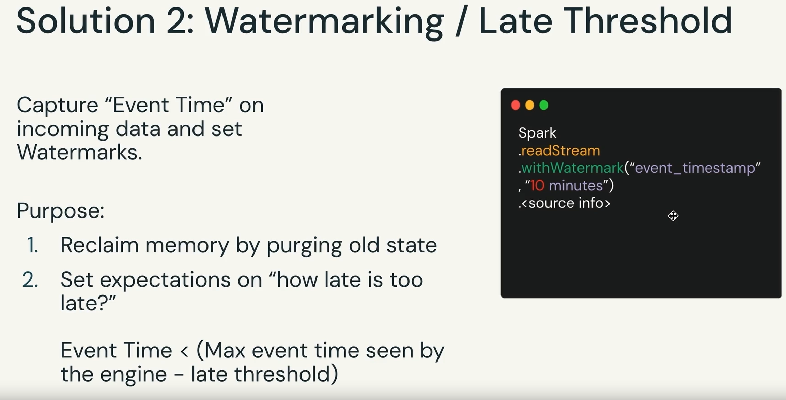
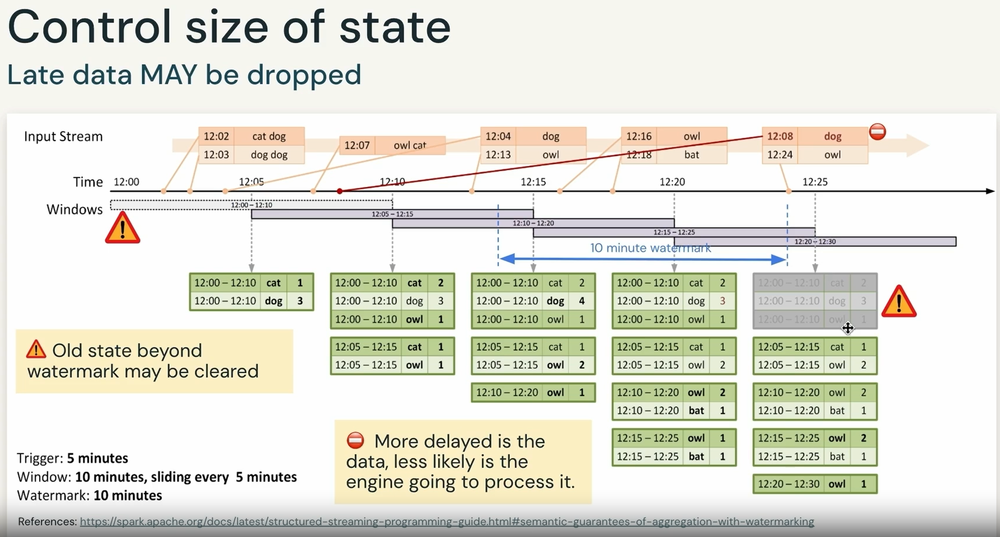


# Join Operations in Structured Streaming  
(Concise Databricks Professional Exam Summary)

## 1. Overview of Streaming Joins
- Structured Streaming supports joins between:  
  - **Streaming ↔ Static** datasets  
  - **Streaming ↔ Streaming** datasets  
- Join results are produced **incrementally**, similar to streaming aggregations.  
- Spark guarantees that the **logical result** of a streaming join matches what you would get if both inputs were static tables containing the same data.

---

# Managing Memory Pressure in Streaming Joins

## 1. Why Memory Grows
For streaming joins, Spark must maintain **state** so that new incoming records can be matched with **any past record**.  
Without constraints, this state grows **unbounded**, causing memory pressure.

---

## 2. Techniques to Avoid Unbounded State

### **1. [Define Watermark Delays](ca://s?q=Explain_watermark_delays_in_streaming) on Both Inputs**
- Watermarks specify how late event‑time data can arrive.  
- Spark can safely drop old state once it is **older than the watermark**.  
- Required for stream‑stream joins to prevent infinite state growth.

### **2. [Add Event‑Time Constraints](ca://s?q=Explain_event_time_constraints_in_streaming_joins) in the Join Condition**
- Restricts how far apart event times can be for matching.  
- Example:  

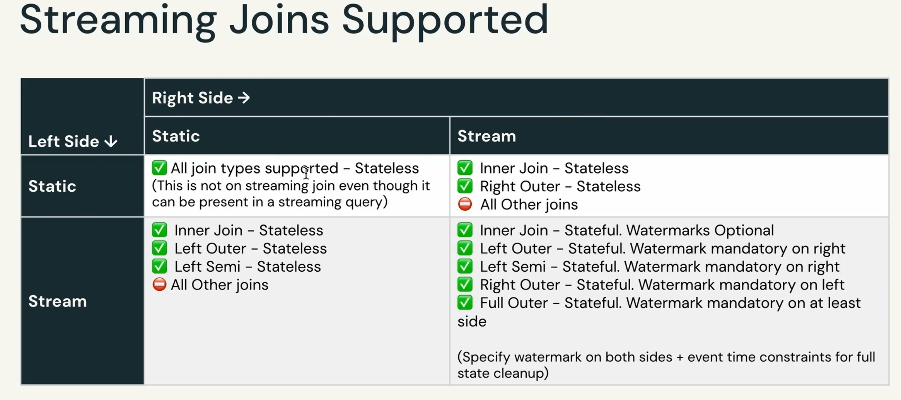

# Why We Need These Patterns  
(Concise Databricks Professional Exam Summary)

## 1. Limitations at the Data Ingestion Layer
Modern streaming sources (Kafka, Kinesis, Event Hubs) are **not designed for long‑term storage**. They provide high‑throughput ingestion but have strict operational limits.

### **Key Limitations**
- **Limited retention** — streaming systems keep data only for a short, configurable window.  
- **High cost for long retention** — storing full history in Kafka/Kinesis is expensive and inefficient.  
- **No long‑term replay guarantees** — once data expires, it cannot be recovered from the source.

---

## 2. Why Additional Patterns Are Needed

### **1. Full Historical Retention**
- Organizations need **complete raw history** for analytics, ML training, audits, and lineage.
- Streaming sources cannot serve as a historical data store.

### **2. Reprocessing Raw Data**
- Required for:  
  - **Backfills**  
  - **Pipeline re‑runs**  
  - **Schema evolution**  
  - **Bug fixes in ETL logic**

### **3. Compliance & Governance**
- Regulations like **GDPR** and **CCPA** require:  
  - Right to erasure  
  - Data audits  
  - Provenance tracking  
- These tasks require **durable, queryable storage**, not ephemeral streaming buffers.

### **4. Data Recovery**
- If downstream systems fail, you must be able to **replay** or **rebuild** data from a reliable source.
- Kafka/Kinesis cannot guarantee recovery beyond their retention window.

### **5. Need for Simple, Maintainable, Scalable Architecture**
- Separating ingestion from storage (e.g., using **Delta Lake Bronze layer**) provides:  
  - Clear lineage  
  - Simplified debugging  
  - Scalable compute/storage separation  
  - Long‑term durability

---

## Exam‑Ready Takeaway
Streaming sources are optimized for **real‑time ingestion**, not **long‑term storage**.  
To support reprocessing, compliance, recovery, and full historical retention, organizations must implement durable storage patterns (e.g., **Bronze/Silver/Gold** in the Lakehouse) rather than relying on Kafka/Kinesis retention.


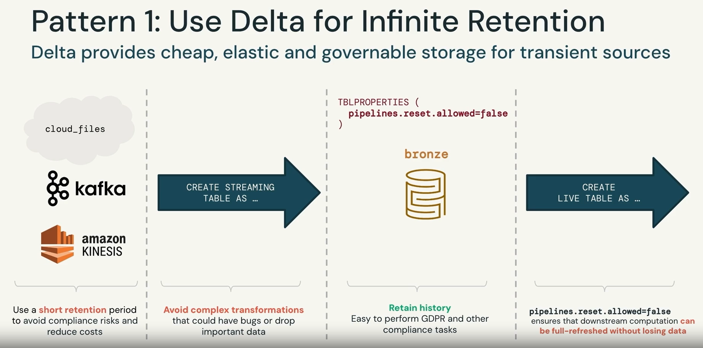
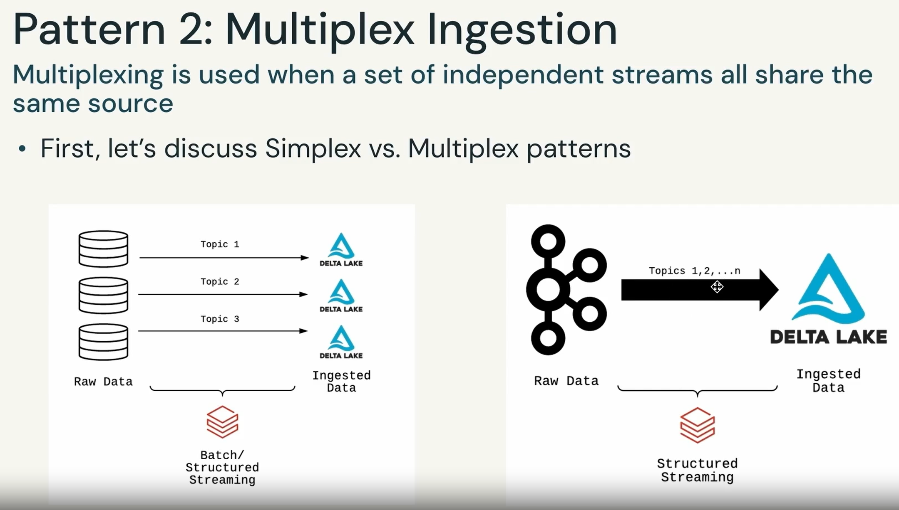
Problem
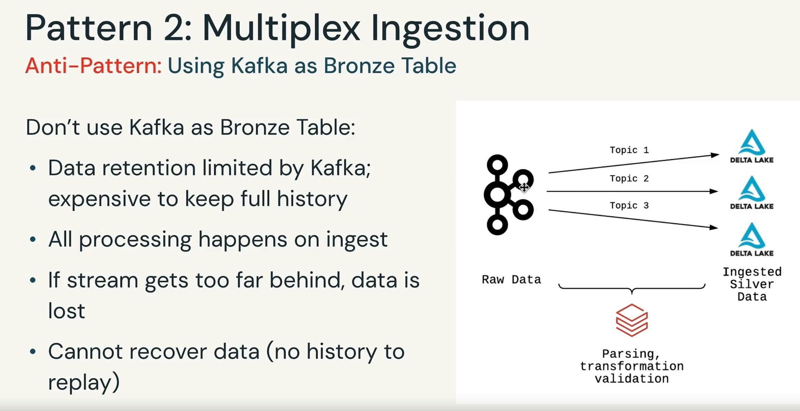
Solution
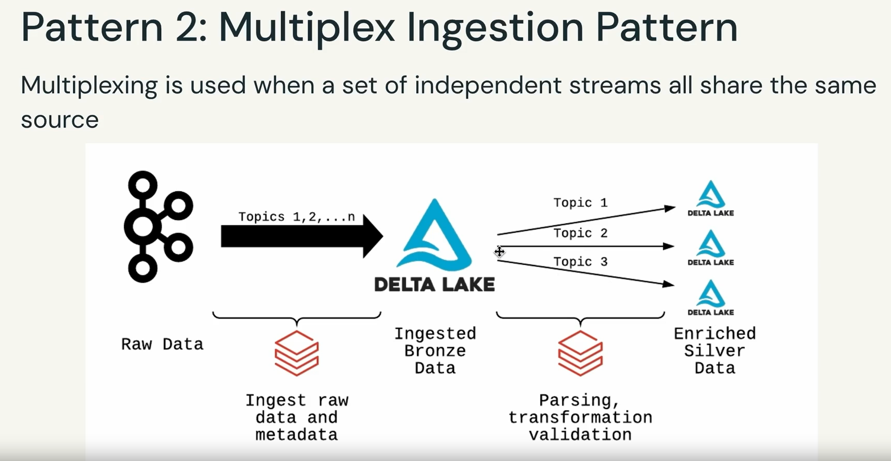


## Autoload to Bronze

```python
import dlt
import pyspark.sql.functions as F

source = spark. conf.get("source")
lookup_db = spark. conf.get("lookup_db")


@dlt.table(
  table_properties={
    "pipelines. reset. allowed": "false"
  }
)

def date_lookup():
  return spark. read. table(f"{lookup_db}.date_lookup").select("date", "week_part")


@dlt.table(
  partition_cols=["topic", "week_part"],
  table_properties={
      "quality": "bronze",
      "pipelines. reset.allowed": "false"
  }
)

def bronze():
    return (
      spark. readStream
        .format("cloudFiles")
        .schema("key BINARY, value BINARY, topic STRING, partition LONG, offset LONG, timestamp LONG")
        .option("cloudFiles. format", "json")
        .load(f"{source}/daily")
        .join(
          F.broadcast(dlt.read("date_lookup")),
          F.to_date((F.col("timestamp")/1000).cast("timestamp")) == F.col("date"), "left")
    )


@dlt.table
def distinct_topics():
    return dlt.read("bronze").select("topic").distinct()

```

### Stream from Multiplex Bronze
```python
import dlt
import pyspark.sql.functions as F

source = spark. conf.get("source")

)

bpm_schema = "device_id LONG, time TIMESTAMP, heartrate DOUBLE"

@dlt.table(
  table_properties={"quality": "bronze"}

def bpm_bronze():
return (
  dlt.read_stream("bronze")
  .filter("topic = 'bpm'")
  .select(F.from_json(F.col("value").cast("string"), bpm_schema).alias("v"))
  .select("v .* ")

```

# Silver Layer for Quality Enforcement  
(Concise Databricks Professional Exam Summary)

## 1. Objectives of the Silver Layer
- **[Validate data quality](ca://s?q=Explain_data_quality_validation_in_Silver_layer)** — enforce schema, apply constraints, remove bad or malformed records.
- **[Enrich and transform data](ca://s?q=How_is_data_enriched_in_Silver_layer)** — standardize formats, apply business rules, join with reference data.
- **[Optimize data layout and storage](ca://s?q=Optimizing_data_layout_in_Silver_layer)** — use partitioning, Z‑Ordering, and efficient file sizes for downstream performance.
- **[Provide a single source of truth](ca://s?q=Silver_layer_single_source_of_truth)** — deliver clean, reliable, analytics‑ready datasets for BI, ML, and Gold‑layer consumption.

## Exam‑Ready Takeaway
The Silver layer converts raw Bronze data into **validated**, **clean**, **enriched**, and **performance‑optimized** datasets that serve as the **trusted foundation** for all downstream analytics.

# Schema Enforcement & Evolution  
(Concise Databricks Professional Exam Summary)

## 1. Schema Enforcement
- **[Prevents bad records](ca://s?q=Explain_schema_enforcement_in_Delta_Lake)** from entering the table.  
- Rejects data with **type mismatches**, **missing fields**, or **unexpected fields**.  
- Ensures **data quality**, **consistency**, and **predictable downstream behavior**.

---

## 2. Schema Evolution
- **[Allows adding new fields](ca://s?q=How_schema_evolution_adds_new_fields_in_Delta)** to support changing production schemas.  
- Useful when new attributes appear in **nested JSON**, IoT payloads, or evolving event schemas.  
- **Cannot remove fields** — evolution is additive only.  
- Previously written records show the **new field as `NULL`**.  
- Underlying Parquet files are **not rewritten**; the new field exists only in **metadata** and is read dynamically.

---

## Exam‑Ready Takeaway
- **Enforcement** → blocks incompatible data.  
- **Evolution** → adds new fields safely without rewriting old data.  
- Old records remain untouched; new columns appear as **NULL** until populated.

# Alternative Quality Check Approaches  
(Concise Databricks Professional Exam Summary)

## 1. **[Validation Field Approach](ca://s?q=Explain_validation_field_approach_in_Delta)**
- Add a dedicated **validation column** that stores results of quality checks.  
- **NULL = passed**, non‑null = validation error details.  
- Allows downstream systems to filter or inspect invalid records without rejecting the entire batch.

---

## 2. **[Quarantine Non‑Compliant Data](ca://s?q=How_to_quarantine_bad_data_in_Delta_Lake)**
- Route invalid or malformed records to a **separate quarantine table/location**.  
- Keeps the main table clean while preserving bad data for debugging, reprocessing, or compliance review.

---

## 3. **[Warn Without Failing](ca://s?q=Warn_without_failing_in_streaming_quality_checks)**
- Instead of failing the pipeline, write **additional fields** capturing constraint check results.  
- Enables soft‑validation: pipeline continues running while still surfacing data quality issues.  
- Useful for gradual enforcement or monitoring data drift.

---

## Exam‑Ready Takeaway
Quality checks can be enforced through:  
1. **Validation fields** (inline error capture)  
2. **Quarantine tables** (isolate bad data)  
3. **Warning‑only checks** (non‑blocking constraints)  

These approaches improve reliability without sacrificing pipeline uptime.

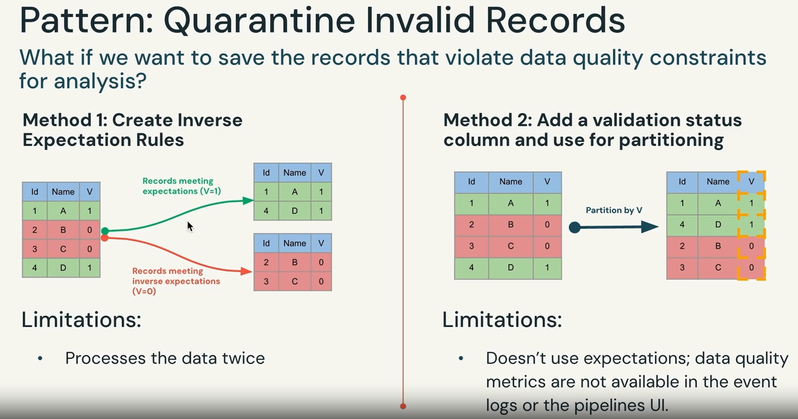
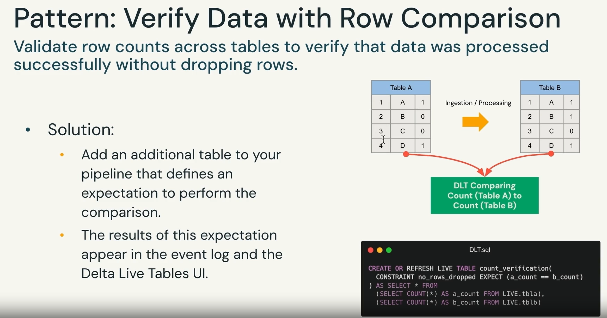
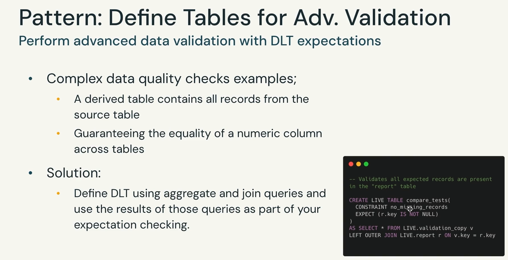
