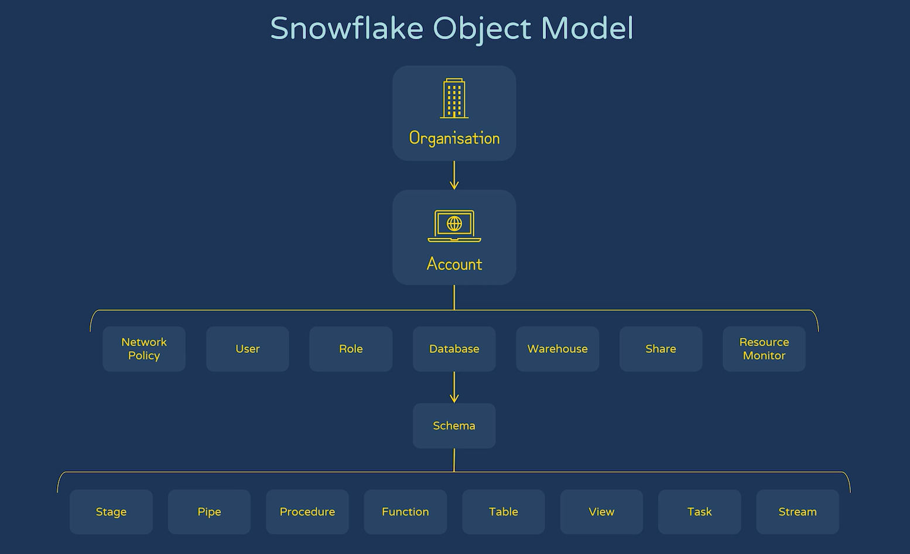
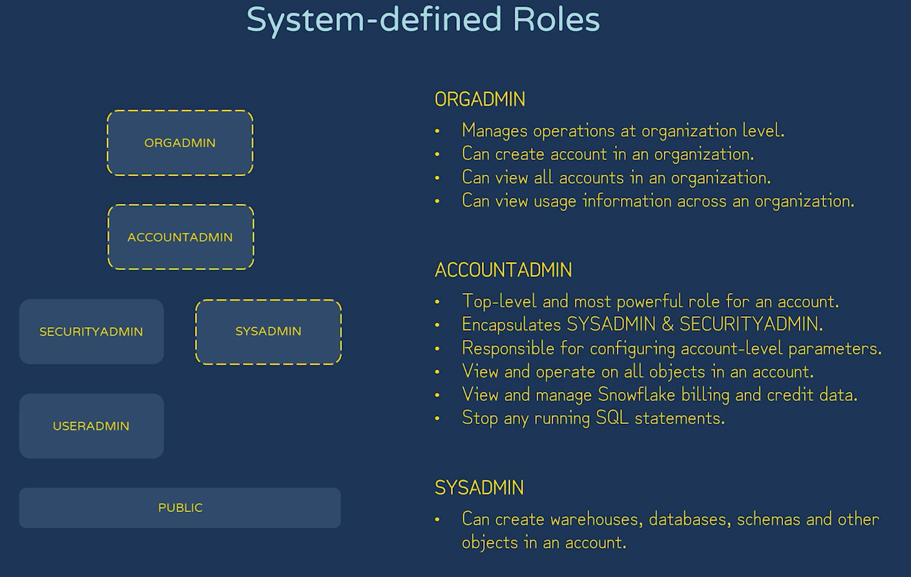
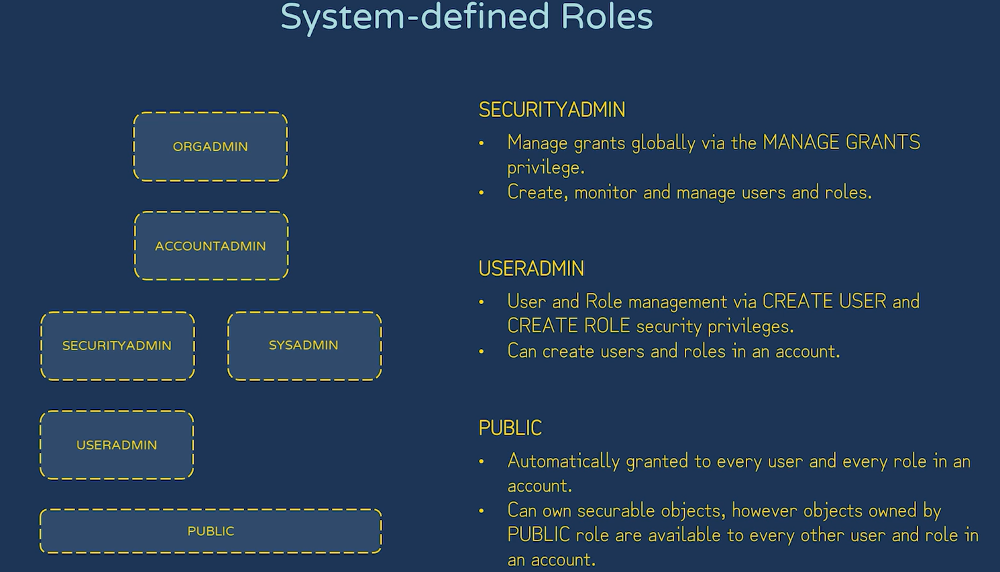

# 🔐 Snowflake Security & Access Control – Quick Notes

---

## 🧩 Role-Based Access Control (RBAC)
- Core security model in Snowflake  
- Access is granted to **roles**, not directly to users  
- Users are assigned roles → roles have privileges on objects  
- Enables scalable and manageable access control  

---

## 🏗️ Securable Object Hierarchy
- Objects are organized in a hierarchy:
  - **Organization → Account → Database → Schema → Table/View**
- 
- Permissions can be granted at different levels  
- Higher-level roles can inherit access to lower-level objects  

---

## 🎯 Discretionary Access Control (DAC)
- Object owners can grant privileges to other roles  
- Based on **ownership and grant permissions**  
- Flexible but requires governance to avoid over-permissioning  

---

## 🌐 Network Policies
- Restrict access based on **IP address ranges**  
- Applied at:
  - Account level  
  - User level  
- Helps secure access from trusted networks only  

---

## 🔑 Authentication Methods

### ✔️ Multi-Factor Authentication (MFA)
- Requires additional verification (OTP, app, etc.)  
- Enhances login security  

### ✔️ Federated Authentication
- Integrates with external Identity Providers (IdPs)  
- Example: Azure AD, Okta  

### ✔️ Single Sign-On (SSO)
- Users log in once via IdP and access Snowflake  
- Improves user experience and centralizes authentication  

### ✔️ OAuth
- Token-based authentication  
- Commonly used for APIs and external applications  

### ✔️ Key-Pair Authentication
- Uses public/private key cryptography  
- Ideal for automated scripts and services  

---

## 👥 System-Defined Roles
- Predefined roles provided by Snowflake  
- Examples:
  - ACCOUNTADMIN  
  - SYSADMIN  
  - SECURITYADMIN  
  - PUBLIC  
- Have built-in privileges for administration  

---

## 🧠 Functional Roles

### 🔹 Account Roles
- Manage privileges at account level  
- Can access multiple databases  

### 🔹 Database Roles
- Scoped within a specific database  
- Simplifies database-level access management  

### 🔹 Custom Roles
- User-defined roles based on business needs  
- Follow least privilege principle  

---

## 🔄 Secondary Roles
- Users can enable multiple roles in a session  
- Allows combining privileges without switching roles  

---

## 🆔 Account Identifiers
- Unique identifiers for Snowflake accounts  
- Used in:
  - Login URLs  
  - Connections (JDBC/ODBC)  

---

## 📊 Logging and Tracing
- Tracks system activity for auditing and debugging  
- Includes:
  - Query history  
  - Login history  
  - Access logs  
- Helps in compliance and troubleshooting  

---